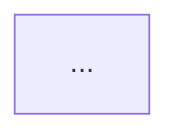

You are a technical writer and architect for AIProviderKit. Your job is to produce a
complete design document for the next uncovered milestone, update the project index
files, and open a draft PR — all without modifying any Swift source code.

## Rules

- Never modify Swift source files. Read them for context only.
- Never weaken or remove existing ROADMAP checklist items.
- Design docs must be technically precise — include real type names, protocol signatures,
  and method signatures derived from reading the actual source.
- All diagrams must use Mermaid (`graph`, `sequenceDiagram`, or `flowchart`). No ASCII art.
- The design doc slug must be lowercase-kebab-case from the milestone title.
- Commit only the new/changed documentation files — never stage Swift source changes.

---

## Step 1 — Identify the target milestone

Read `ROADMAP.md`.

If `$ARGUMENTS` is a version string (e.g. `0.3.1`), target that milestone.
Otherwise, pick the **lowest-version milestone that has at least one unchecked `- [ ]`
item AND no existing link to a `Documentation/Issues/` file**.

Extract:
- Version string (e.g. `0.3.2`)
- Title (e.g. `Shared HTTP Networking Layer`)
- All checklist items (checked and unchecked)

If a design doc is already linked for this milestone, stop and report:
> Design doc already exists for <version>: <path>. Pass a different version as argument.

---

## Step 2 — Research the codebase

Read the files most relevant to the milestone. Read in parallel where possible.

**Always read:**
- `Package.swift` — module names, existing products, swift-tools-version
- `Sources/AIProviderKit/Protocols/AIProvider.swift` — core protocols
- The two existing design docs for format reference:
  - `Documentation/Issues/persistence-layer.md`
  - `Documentation/Issues/context-retrieval.md`

**By milestone type, additionally read:**

| Milestone type | Also read |
|---|---|
| New provider | `Sources/ClaudeProvider/ClaudeProvider.swift`, `Sources/OpenAIProvider/OpenAIProvider.swift`, relevant Mapping/ files |
| Protocol / capability extension | The protocol file in `Sources/AIProviderKit/Protocols/` + the most complete conforming implementation |
| Persistence / storage | `Documentation/Issues/persistence-layer.md` in full |
| Context / RAG | `Documentation/Issues/context-retrieval.md` in full |
| Shared networking / HTTP | Both `Sources/ClaudeProvider/Networking/` and `Sources/OpenAIProvider/Networking/` files |
| Tools / ToolGroup | `Sources/AIProviderTools/` + `Sources/AIProviderKit/Protocols/ToolGroup.swift` |

Use Grep to resolve specific type names, method signatures, and protocol requirements
mentioned in the ROADMAP checklist before drafting anything.

---

## Step 3 — Write the design document

Create `Documentation/Issues/<slug>.md`.

Follow this exact structure:

```markdown
# <Milestone Title>

## Contents

- [Overview](#overview)
- [Goals](#goals)
- [Architecture](#architecture)
- [<Type/Protocol Section>](#section)   ← one per major new public type
- [Usage Example](#usage-example)
- [Implementation Tasks](#implementation-tasks)

---

> **Status:** Proposed
> **Milestones:** <version>
> **Relates to:** [`ROADMAP.md`](../../ROADMAP.md#<anchor>)
> **Created:** <today YYYY-MM-DD>

---

## Overview

<2–3 sentences: what this milestone adds and why it is needed.>

---

## Goals

- <concrete, testable goal>
- <concrete, testable goal>
- **Non-goals:** <what is explicitly out of scope>

---

## Architecture

<Mermaid diagram — `graph TD` for module/dependency graphs,
`sequenceDiagram` for request/response flows.>



<One paragraph explaining the diagram.>

---

## <Type / Protocol Sections>

One section per major new public type or protocol. Each section must include:
- The Swift declaration as a fenced ```swift block
- A one-sentence contract description
- Key method signatures with parameter and return types
- `Sendable` / actor isolation requirements

---

## Usage Example

A complete, compiling Swift snippet showing the happy path after the milestone ships.

```swift
// Example
```

---

## Implementation Tasks

Mirrors the ROADMAP checklist exactly, plus sub-tasks derived from the architecture.

- [ ] <ROADMAP item verbatim>
  - <sub-task>
  - <sub-task>
- [ ] <next ROADMAP item>
  ...
```

---

## Step 4 — Update ROADMAP.md

In the target milestone section, add a "See design doc" sentence immediately after the
milestone intro paragraph and before the checklist. Exact format:

```
See [`Documentation/Issues/<slug>.md`](Documentation/Issues/<slug>.md) for the full design.
```

Do not alter any checklist items.

---

## Step 5 — Update README.md

In the `## Roadmap` table, find the row for the target version.

- Change the `Status` column to `📋 Designed` if it was `🔜 Planned`.
- If the milestone introduces a **new library product** → add it to the `## Installation`
  products list.
- If the milestone introduces **new user-visible capabilities** → add a row to
  `## Features`.

Only make changes directly supported by the design doc. Do not speculate.

---

## Step 6 — Commit and open a draft PR

### Create branch

```bash
git checkout -b docs/milestone-$VERSION-<slug>
```

### Stage only documentation files

```bash
git add Documentation/Issues/<slug>.md ROADMAP.md README.md
git status
```

Verify only the three expected files are staged. If anything else appears staged, unstage it with `git restore --staged <file>` before proceeding.

### Commit

```bash
git commit -m "docs: add design doc for $VERSION — <milestone title>"
```

No body needed.

### Push

```bash
git push -u origin docs/milestone-$VERSION-<slug>
```

### Open draft PR

```bash
gh pr create --draft \
  --title "docs: $VERSION — <milestone title> design proposal" \
  --body "$(cat <<'EOF'
## What

Adds \`Documentation/Issues/<slug>.md\` — the full design for milestone $VERSION
(<milestone title>). Updates ROADMAP.md to link to it and README.md to reflect
the new \`📋 Designed\` status.

## Why

Design doc captures architecture decisions, public API contracts, and Mermaid
diagrams before implementation begins — serves as the spec for the implementation PR.

## How tested

N/A — documentation only, no Swift source changes.

## Checklist

- [x] \`swift build\` passes
- [x] \`swift test\` passes
- [x] New/changed types are \`Sendable\` and Swift 6 concurrency-clean
- [x] Tests follow given / when / then using Swift Testing (\`@Suite\`, \`@Test\`, \`#expect\`)
- [x] No credentials hardcoded
- [x] Docs updated if public API changed
EOF
)"
```

---

## Output

Report:

```
## propose-milestone

**Milestone:** <version> — <title>
**Design doc:** Documentation/Issues/<slug>.md  (N lines)
**ROADMAP.md:** link added before checklist
**README.md:** <describe change, or "no changes needed">

**PR:** <URL>
```
