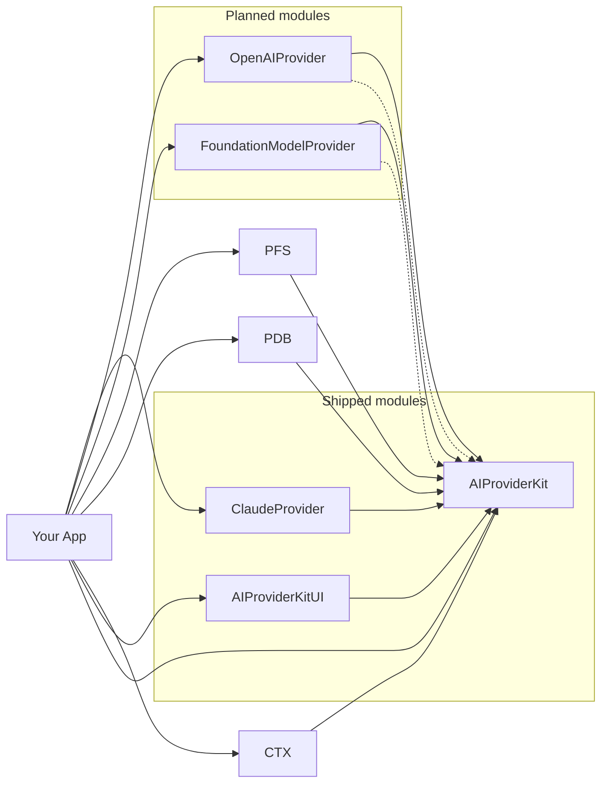
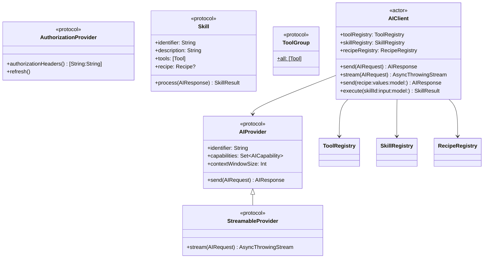
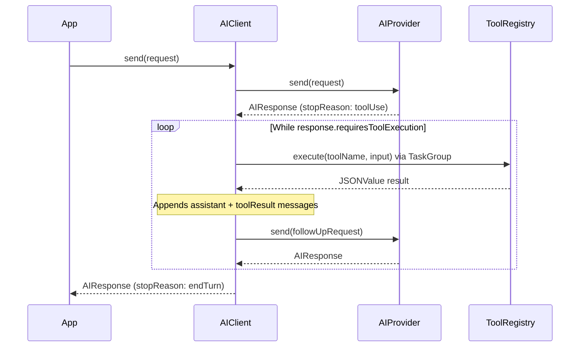
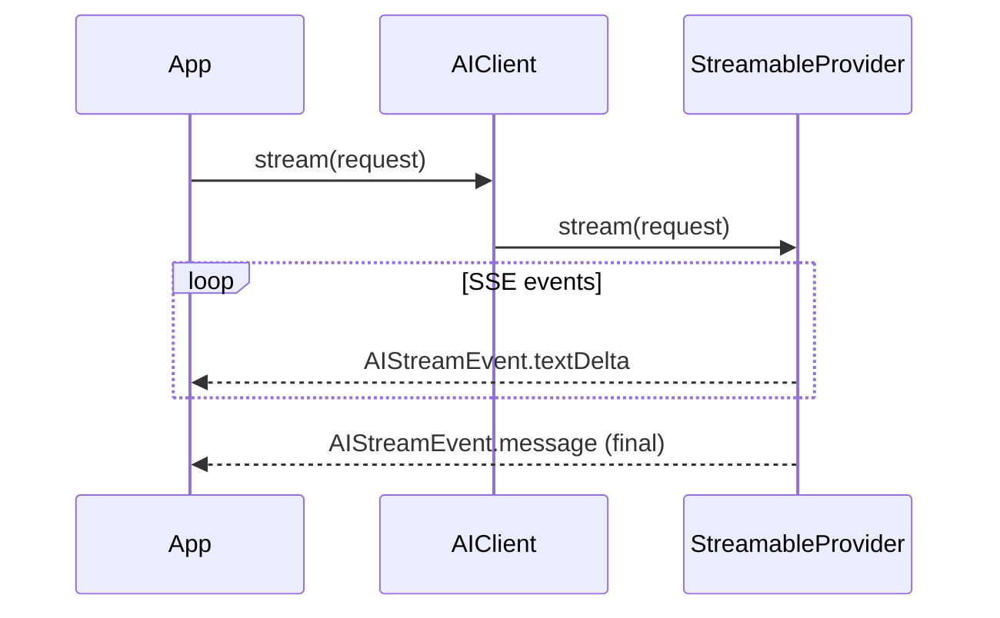
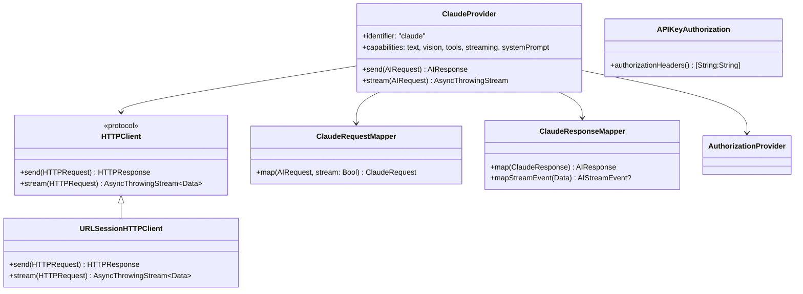
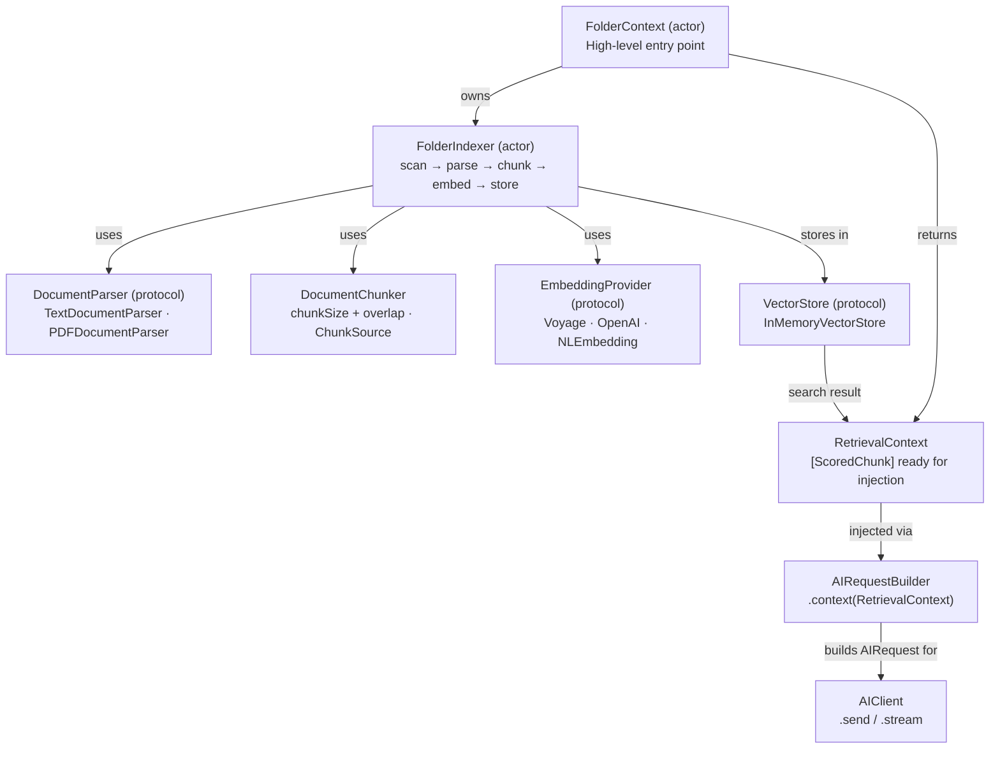
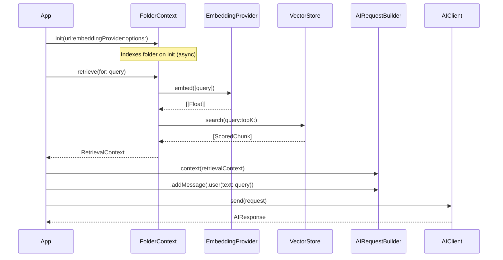
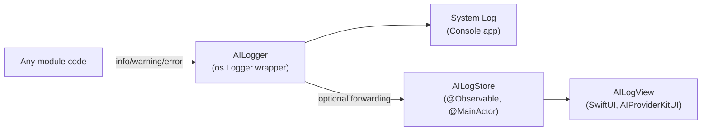
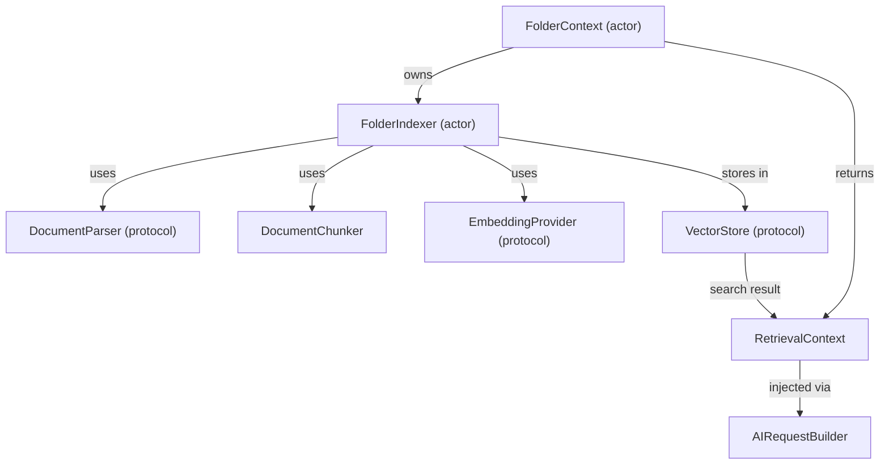

# Architecture

## Contents

- [Overview](#overview)
- [Module Structure](#module-structure)
- [Core Abstractions](#core-abstractions)
- [Request Lifecycle](#request-lifecycle)
- [Streaming Flow](#streaming-flow)
- [ClaudeProvider Internals](#claudeprovider-internals)
- [Adding a New Provider](#adding-a-new-provider)
- [Concurrency Model](#concurrency-model)
- [Logging Architecture](#logging-architecture)
- [Context Layer (Planned)](#context-layer-planned)

---

## Overview

AIProviderKit is a Swift package that provides a provider-agnostic abstraction layer for interacting with AI models. The package targets iOS 26+, macOS 14+, watchOS 11+, tvOS 26+, and visionOS 2+, built with Swift 6 and full strict concurrency compliance.

The package ships three library products today:

- **AIProviderKit** -- the core module containing protocols, models, builders, registries, and the `AIClient` actor. Zero external dependencies.
- **ClaudeProvider** -- the Anthropic Messages API implementation. Depends only on `AIProviderKit`.
- **AIProviderKitUI** -- an optional SwiftUI `AILogView` for in-app log viewing. Depends only on `AIProviderKit`.

Additional provider modules (`FoundationModelProvider`, `OpenAIProvider`) and persistence/context modules are planned for future milestones but do not exist in the codebase today.

---

## Module Structure

Dashed arrows indicate planned dependencies not yet present in the codebase.

---

## Core Abstractions

### Key types

| Type | Role |
|---|---|
| `AIClient` (actor) | Main entry point. Coordinates the provider, registries, and the automatic tool-execution loop. |
| `AIProvider` (protocol) | The single integration point for new AI backends. Requires `identifier`, `capabilities`, and `send(_:)`. |
| `StreamableProvider` (protocol) | Extends `AIProvider` with `stream(_:)` for server-sent event streaming. |
| `AuthorizationProvider` (protocol) | Supplies HTTP authorization headers. Implementations include `APIKeyAuthorization`. |
| `ContentBlock` (enum) | Universal currency for message content: `.text`, `.image`, `.toolUse`, `.toolResult`. All providers map to/from this type. |
| `JSONValue` (enum) | Type-safe, `Sendable`, `Codable` representation of arbitrary JSON. Used for tool inputs and outputs, avoiding `Any`. |
| `Tool` (struct) | A callable tool with a name, description, `JSONSchema` input schema, and an async handler. |
| `Recipe` (struct) | A reusable prompt template with `{{placeholder}}` substitution. |
| `Skill` (protocol) | Bundles tools, an optional recipe, and post-processing logic into a reusable capability. |
| `ToolRegistry` (actor) | Thread-safe storage and lookup for `Tool` instances. Supports bulk registration via `ToolGroup`. |
| `SkillRegistry` (actor) | Thread-safe storage and lookup for `Skill` instances. |
| `RecipeRegistry` (actor) | Thread-safe storage and lookup for `Recipe` instances. |
| `AICapability` (enum) | Declares what a provider supports: `.text`, `.vision`, `.tools`, `.streaming`, `.systemPrompt`. |
| `AIRequestBuilder` (class) | Fluent builder for `AIRequest` with validation on `build()`. |
| `ContentBlockBuilder` | Result builder for constructing `[ContentBlock]` arrays declaratively. |
| `ConversationBuilder` | Result builder for constructing `[Message]` arrays declaratively. |

### Built-in tool groups

Three `ToolGroup`-conforming enums ship in `AIProviderKit`:

- `CalendarTool` -- `list_calendar_events`, `create_calendar_event` (EventKit)
- `RemindersTool` -- `list_reminders`, `create_reminder` (EventKit)
- `LocationTool` -- `get_current_location` (CoreLocation, with optional reverse geocoding)

---

## Request Lifecycle

When `AIClient.send(_:)` is called, the request flows through the provider and, if the model returns tool-use blocks, enters an automatic execution loop.

Tool executions within a single turn run concurrently via `withThrowingTaskGroup`. The client constructs a follow-up request by appending the assistant's tool-use message and the user's tool-result message to the original conversation, preserving the full history.

---

## Streaming Flow

Streaming bypasses the automatic tool-execution loop. The caller receives raw `AIStreamEvent` values and is responsible for handling any tool-use turns manually.

If the provider does not conform to `StreamableProvider`, `AIClient.stream(_:)` returns a stream that immediately throws `AIError.providerUnsupported(capability: .streaming)`.

`AIStreamEvent` has three cases: `.textDelta(String)`, `.toolUseDelta(id:name:inputDelta:)`, and `.message(AIResponse)`.

---

## ClaudeProvider Internals

`ClaudeProvider` conforms to `StreamableProvider` and uses a mapper pattern to isolate the Anthropic-specific wire format from the core abstractions.

- **`ClaudeRequestMapper`** converts `AIRequest` into the `ClaudeRequest` Encodable struct, mapping `ContentBlock` to `ClaudeContentBlock`, `Tool` to `ClaudeTool`, and `Message` to `ClaudeMessage`. System prompts are extracted to the top-level `system` field per Anthropic's API format.
- **`ClaudeResponseMapper`** converts `ClaudeResponse` back to `AIResponse`, mapping content blocks and stop reasons. For streaming, it parses `content_block_delta` SSE events with `text_delta` type.
- **`HTTPClient`** is an internal protocol with `send` and `stream` methods. The production implementation (`URLSessionHTTPClient`) uses `URLSession`; tests inject `MockHTTPClient`.
- **`APIKeyAuthorization`** implements `AuthorizationProvider` by returning `["x-api-key": apiKey]`.

Model constants are defined as static extensions on `AIModel`: `.claudeOpus4`, `.claudeSonnet4`, `.claudeHaiku4`.

---

## Adding a New Provider

To add a new AI provider (e.g., OpenAI), follow this checklist:

1. Add a new library target in `Package.swift` with a dependency on `AIProviderKit`.
2. Create a folder under `Sources/` (e.g., `Sources/OpenAIProvider/`).
3. Implement the mapper pair:
   - `XRequestMapper` -- converts `AIRequest` to the provider's wire format.
   - `XResponseMapper` -- converts the provider's response to `AIResponse` and `AIStreamEvent`.
4. Implement `HTTPClient` (or reuse `URLSessionHTTPClient` if the wire protocol is standard REST/SSE).
5. Create the provider class conforming to `AIProvider` (or `StreamableProvider` if streaming is supported).
6. Extend `AIModel` with provider-specific model constants (e.g., `.gpt4o`).
7. No changes to `AIClient` or any core type are required.

See [`Documentation/AddingAProvider.md`](AddingAProvider.md) for a full walkthrough.

---

## Concurrency Model

The package uses Swift 6 strict concurrency throughout. Both `StrictConcurrency` and `ExistentialAny` upcoming features are enabled on all targets.

**Actors** provide thread-safe mutable state:
- `AIClient` is an actor. All public methods (`send`, `stream`, `execute`) are isolated to the actor.
- `ToolRegistry`, `SkillRegistry`, and `RecipeRegistry` are actors. Registration and lookup operations are actor-isolated.

**Sendable compliance** is enforced across all public types:
- All model types (`AIRequest`, `AIResponse`, `ContentBlock`, `JSONValue`, `Tool`, `Recipe`, `Message`, `TokenUsage`, `StopReason`, `AICapability`, `AIModel`, `SkillResult`, `AILogEntry`, `AILogLevel`) are `Sendable` value types.
- Protocols (`AIProvider`, `StreamableProvider`, `AuthorizationProvider`, `Skill`) require `Sendable` conformance.
- `Tool.handler` is typed as `@Sendable (JSONValue) async throws -> JSONValue`.
- `ClaudeProvider` is a `final class` (not an actor) because it holds only `Sendable` dependencies and performs no mutable state changes after initialization.
- `URLSessionHTTPClient` is `@unchecked Sendable` because `URLSession` predates Swift concurrency.

**Structured concurrency** is used for parallel tool execution: `AIClient.executeTools` uses `withThrowingTaskGroup` to run all tool calls from a single model turn concurrently.

**MainActor isolation**: `AILogStore` is `@MainActor`-isolated and uses `@Observable` for SwiftUI reactivity. `AILogger` forwards entries to `AILogStore.shared` via `Task { @MainActor in ... }`.

---

## Context Layer — AIProviderKitContext

> Planned for milestones 0.7.0 – 0.7.7. See [`Documentation/Issues/context-retrieval.md`](Issues/context-retrieval.md) for the full design.

### Context Retrieval Flow

---

## Logging Architecture

`AILogger` is a lightweight `Sendable` struct that wraps `os.Logger`. It writes to the system log unconditionally and optionally forwards entries to `AILogStore.shared` for in-app display. `AILogStore` is `@Observable` and `@MainActor`-isolated, enabling `AILogView` to react to new entries automatically. The store caps entries at `maximumEntries` (default 1,000), evicting the oldest first.

---

## Context Layer (Planned)

> **Status:** Not yet implemented. Planned for a future milestone. See [`Documentation/Issues/context-retrieval.md`](Issues/context-retrieval.md) for the full design.

The Context layer will introduce a new module (`AIProviderKitContext`) for augmenting model requests with relevant chunks retrieved from local document folders. The planned design includes:

- **`FolderContext`** (actor) -- high-level entry point for indexing and retrieval
- **`FolderIndexer`** (actor) -- scan, parse, chunk, embed, store pipeline
- **`DocumentParser`** (protocol) -- extensible document parsing (`TextDocumentParser`, `PDFDocumentParser`)
- **`DocumentChunker`** -- configurable chunk size and overlap
- **`EmbeddingProvider`** (protocol) -- pluggable embeddings (Voyage, OpenAI, NLEmbedding)
- **`VectorStore`** (protocol) -- pluggable vector storage (`InMemoryVectorStore`)
- **`RetrievalContext`** -- scored chunks ready for injection into `AIRequestBuilder`

