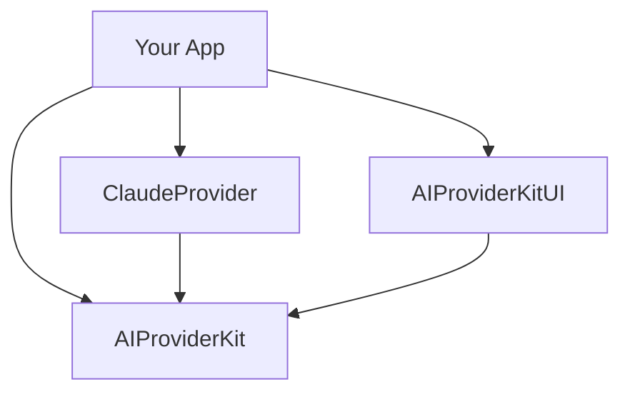
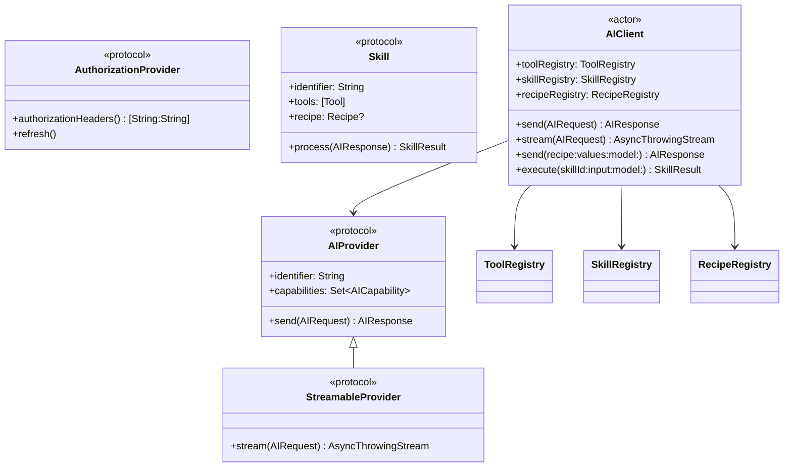
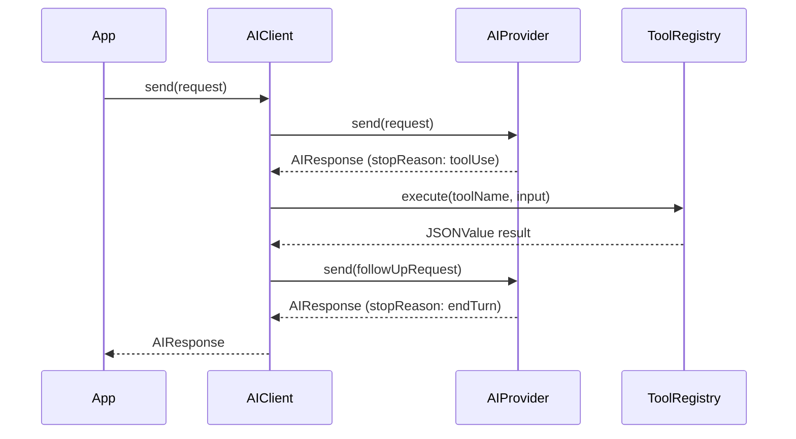
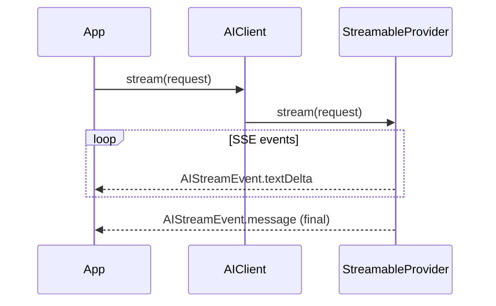
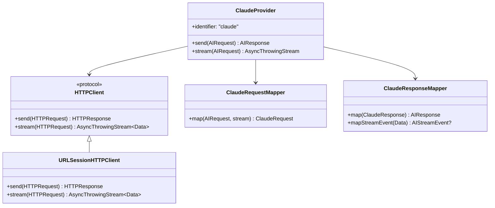
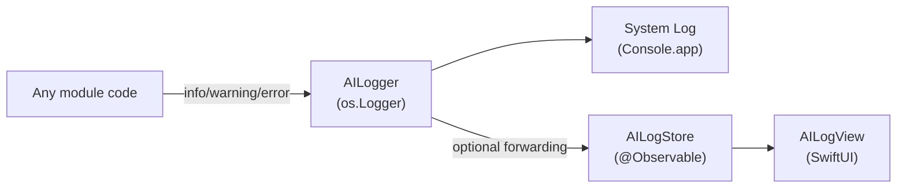

# Architecture

## Package Structure

```
AIProviderKit (core)
└── ClaudeProvider
└── AIProviderKitUI

Tests
├── AIProviderKitTests
└── ClaudeProviderTests
```

---

## Module Dependency Graph



---

## Core Layer — AIProviderKit



---

## Request / Response Flow



---

## Streaming Flow



---

## ClaudeProvider Internals



---

## Logging Architecture


