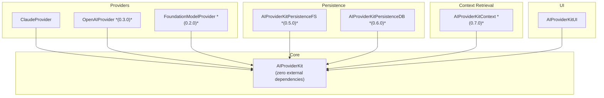
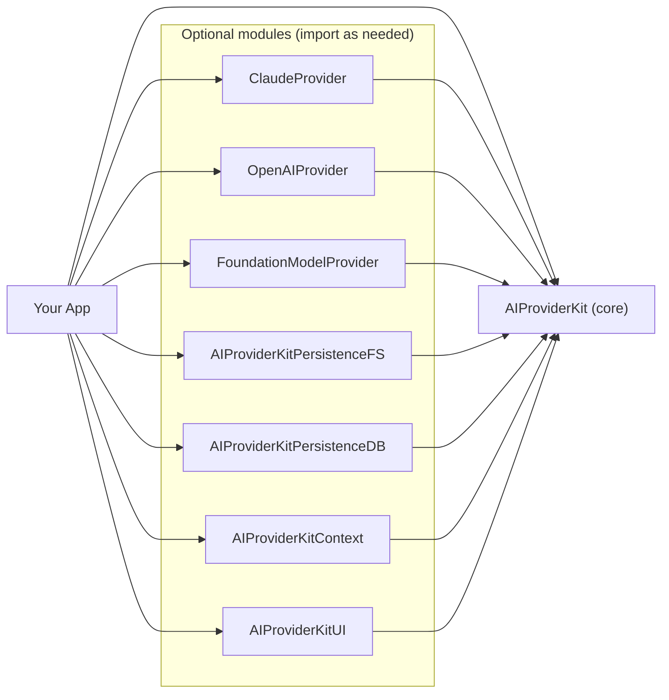
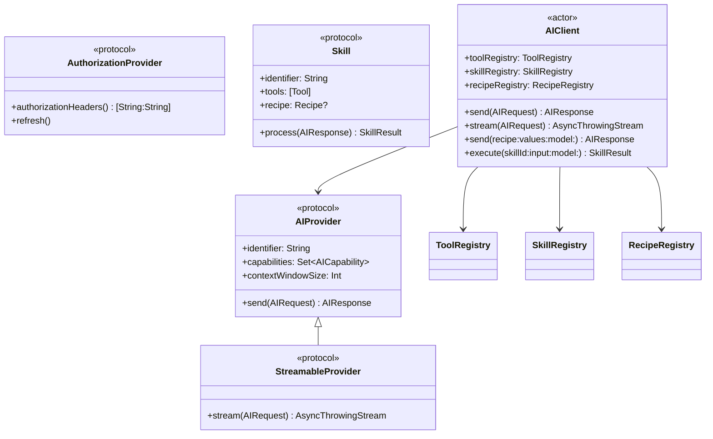
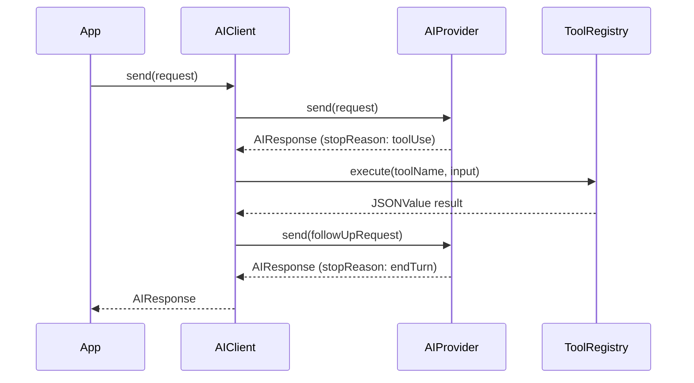
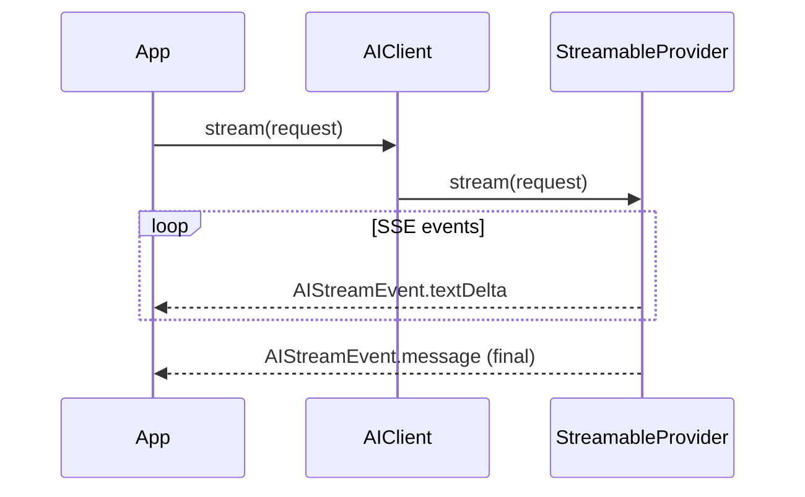
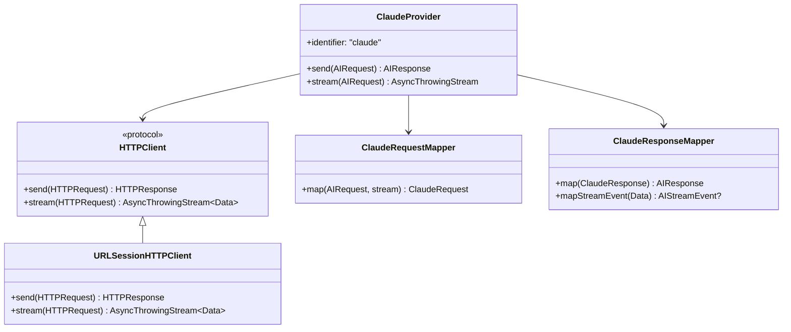
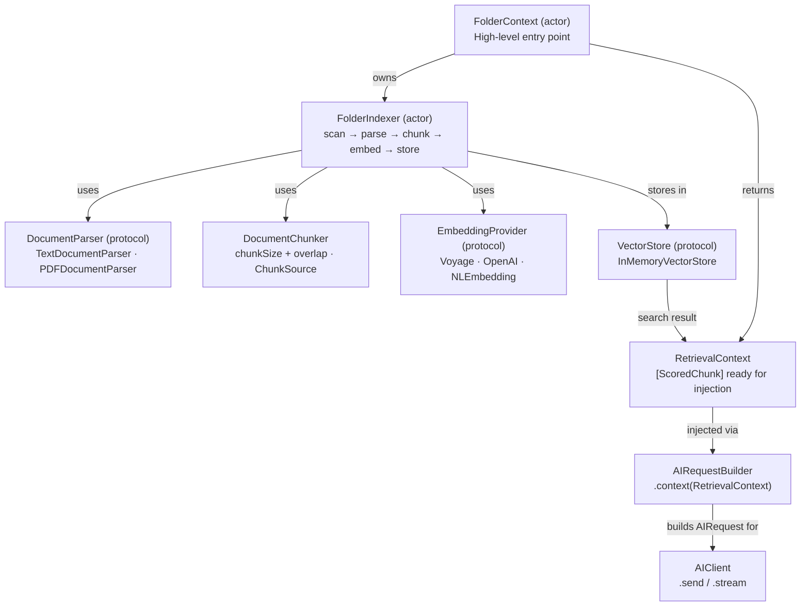
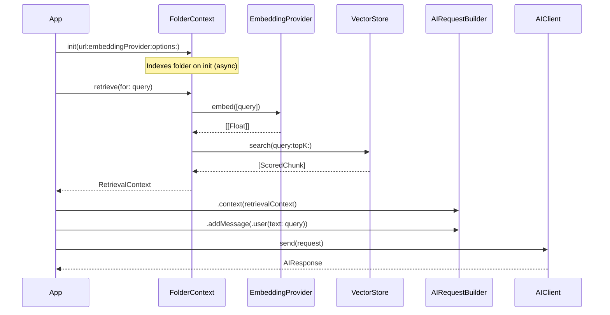
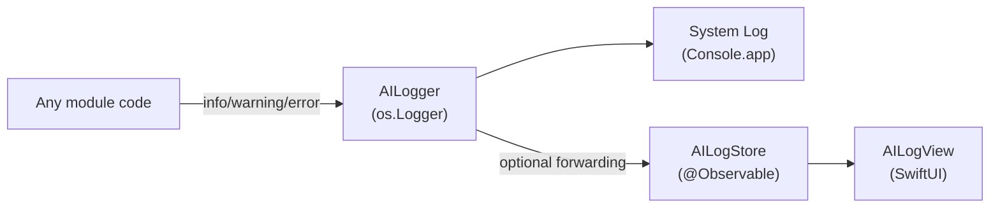

# Architecture

## Contents

- [Package Structure](#package-structure)
- [Module Dependency Graph](#module-dependency-graph)
- [Core Layer — AIProviderKit](#core-layer--aiproviderkitkit)
- [Request / Response Flow](#request--response-flow)
- [Streaming Flow](#streaming-flow)
- [ClaudeProvider Internals](#claudeprovider-internals)
- [Context Layer — AIProviderKitContext](#context-layer--aiproviderkitcontext)
- [Logging Architecture](#logging-architecture)

---

## Package Structure

---

## Module Dependency Graph

---

## Core Layer — AIProviderKit

---

## Request / Response Flow

---

## Streaming Flow

---

## ClaudeProvider Internals

---

## Context Layer — AIProviderKitContext

> Planned for milestones 0.7.0 – 0.7.7. See [`Documentation/Issues/context-retrieval.md`](Issues/context-retrieval.md) for the full design.

### Context Retrieval Flow

---

## Logging Architecture

