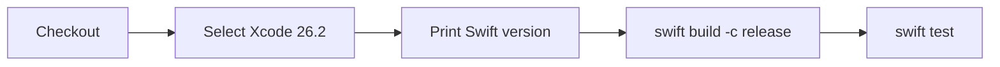

# GitHub Actions

## Overview

AIProviderKit ships with a single CI workflow that builds the package and runs the full test suite on every push and pull request to `main`. The workflow result powers the **CI badge** in the README.

```
.github/
└── workflows/
    └── ci.yml   ← Build & Test
```

---

## Workflow: CI (`ci.yml`)

### Triggers

| Event | Branches |
|---|---|
| `push` | `main` |
| `pull_request` | `main` |

Concurrent runs for the same ref are cancelled automatically (`cancel-in-progress: true`), so stale builds don't queue up.

### Runner & Xcode

| | Value |
|---|---|
| Runner | `macos-26` |
| Xcode | `26.2` |
| Swift | 6.x (bundled with Xcode 26.2) |

### Steps



| Step | Command | Purpose |
|---|---|---|
| Checkout | `actions/checkout@v4` | Clone the repository |
| Select Xcode | `xcode-select -s` | Pin the exact toolchain |
| Swift version | `swift --version` | Log the resolved toolchain for debugging |
| Build | `swift build -c release` | Verify the package compiles in release mode |
| Test | `swift test` | Run all test targets (`AIProviderKitTests`, `ClaudeProviderTests`) |

Build and test output is piped through `xcpretty` when available; the raw `swift` output is used as a fallback so the step never fails due to a missing formatter.

---

## README Badge

The CI badge at the top of the README reflects the latest run on `main`:

```markdown
[](https://github.com/molayab/swift-ai-provider-kit/actions/workflows/ci.yml)
```

The badge updates automatically — no manual intervention needed.

---

## Adding New Workflows

Follow this naming convention when adding workflows:

| Workflow | File | Suggested trigger |
|---|---|---|
| CI (build + test) | `ci.yml` | `push`, `pull_request` |
| Release / tag | `release.yml` | `push` to tags `v*` |
| Dependency audit | `audit.yml` | `schedule` (weekly) |
| Docs deployment | `docs.yml` | `push` to `main` |

Each workflow should pin its runner to `macos-26` and Xcode to `26.2` to stay consistent with the package's minimum toolchain.

---

## Running CI Locally

Use the same commands the workflow runs:

```bash
# Build (release)
swift build -c release

# Run all tests
swift test

# Run a specific test target
swift test --filter AIProviderKitTests
swift test --filter ClaudeProviderTests

# Run a single test by name
swift test --filter AIClientTests/sendForwardsRequest
```
