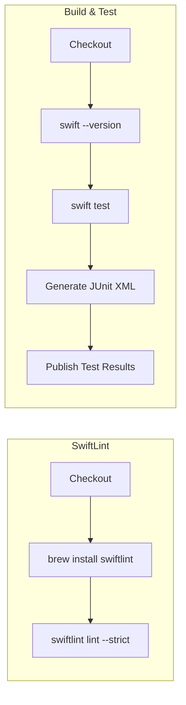

# GitHub Actions

## Overview

AIProviderKit ships with a single CI workflow that runs on every push and pull request to `main`. It has two jobs, both of which are **required status checks** — a branch cannot be merged unless both pass.

```
.github/
└── workflows/
    └── ci.yml   ← SwiftLint + Build & Test
```

---

## Workflow: CI (`ci.yml`)

### Triggers

| Event | Branches |
|---|---|
| `push` | `main` |
| `pull_request` | `main` |

Concurrent runs for the same ref are cancelled automatically (`cancel-in-progress: true`), so stale builds don't queue up.

### Runner

| | Value |
|---|---|
| Runner | `macos-26` |
| Swift | 6.x (bundled with Xcode on `macos-26`) |

---

### Job 1 — SwiftLint

Installs SwiftLint via Homebrew and runs the full codebase check in strict mode.

| Step | Detail |
|---|---|
| Checkout | `actions/checkout@v4` |
| Install | `brew install swiftlint` |
| Lint | `swiftlint lint --strict --reporter github-actions-logging` |

`--strict` promotes warnings to errors — zero violations are tolerated.
`--reporter github-actions-logging` annotates violations inline on the PR diff.

> SwiftLint is intentionally **not** an SPM build plugin. Attaching it to library targets forces downstream consumers to fetch, compile, and trust the plugin. CI-only enforcement avoids that overhead entirely.

---

### Job 2 — Build & Test

Runs the full Swift Testing suite and publishes results as a check annotation.

| Step | Detail |
|---|---|
| Checkout | `actions/checkout@v4` |
| Swift version | `swift --version` — logs the resolved toolchain |
| Test | `swift test` — runs `AIProviderKitTests` and `ClaudeProviderTests` |
| Generate JUnit XML | Python script parses `swift test` output into JUnit XML |
| Publish results | `dorny/test-reporter@v1` — annotates each test result on the PR |

A custom Python parser is used because `--xunit-output` is XCTest-only and produces no output when all tests use Swift Testing (`import Testing`).

---

### Flow



Both jobs run in parallel. Both must pass for a PR to be mergeable.

---

## Required Status Checks

Configure these once in **Settings → Branches → Branch protection rules** for `main`:

1. Enable **"Require status checks to pass before merging"**
2. Add both checks (they appear after the first CI run on the branch):
   - `SwiftLint`
   - `Build & Test`
3. Enable **"Require branches to be up to date before merging"**

---

## README Badge

The CI badge at the top of the README reflects the latest run on `main`:

```markdown
[](https://github.com/molayab/swift-ai-provider-kit/actions/workflows/ci.yml)
```

---

## Adding New Workflows

Follow this naming convention when adding workflows:

| Workflow | File | Suggested trigger |
|---|---|---|
| CI (lint + test) | `ci.yml` | `push`, `pull_request` |
| Release / tag | `release.yml` | `push` to tags `v*` |
| Dependency audit | `audit.yml` | `schedule` (weekly) |
| Docs deployment | `docs.yml` | `push` to `main` |

Each workflow should pin its runner to `macos-26` to stay consistent with the package's minimum toolchain.

---

## Running CI Locally

```bash
# Lint (requires: brew install swiftlint)
swiftlint lint --strict

# Run all tests (no API key required — all providers are mocked)
swift test

# Run a specific test target
swift test --filter AIProviderKitTests
swift test --filter ClaudeProviderTests

# Run a single test by name
swift test --filter AIClientTests/sendForwardsRequest

# Integration tests (requires ANTHROPIC_API_KEY)
ANTHROPIC_API_KEY=<YOUR_ANTHROPIC_API_KEY> swift package integration-tests
```
