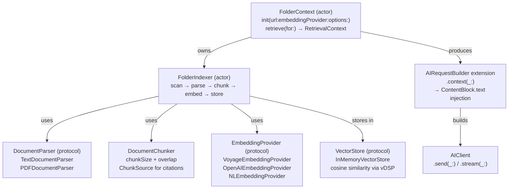
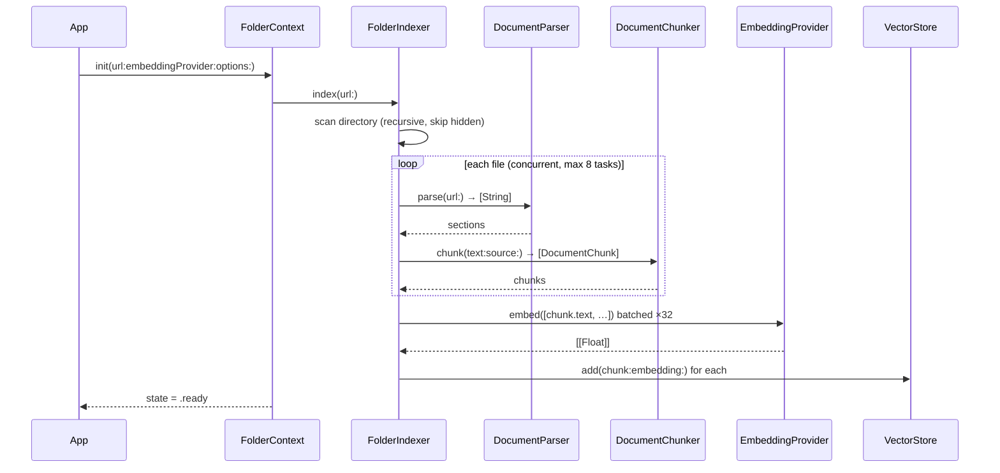
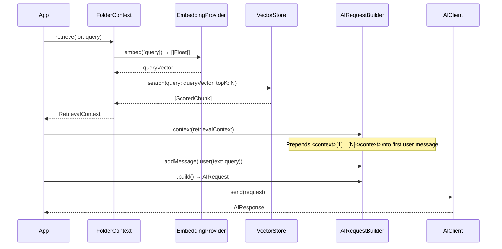
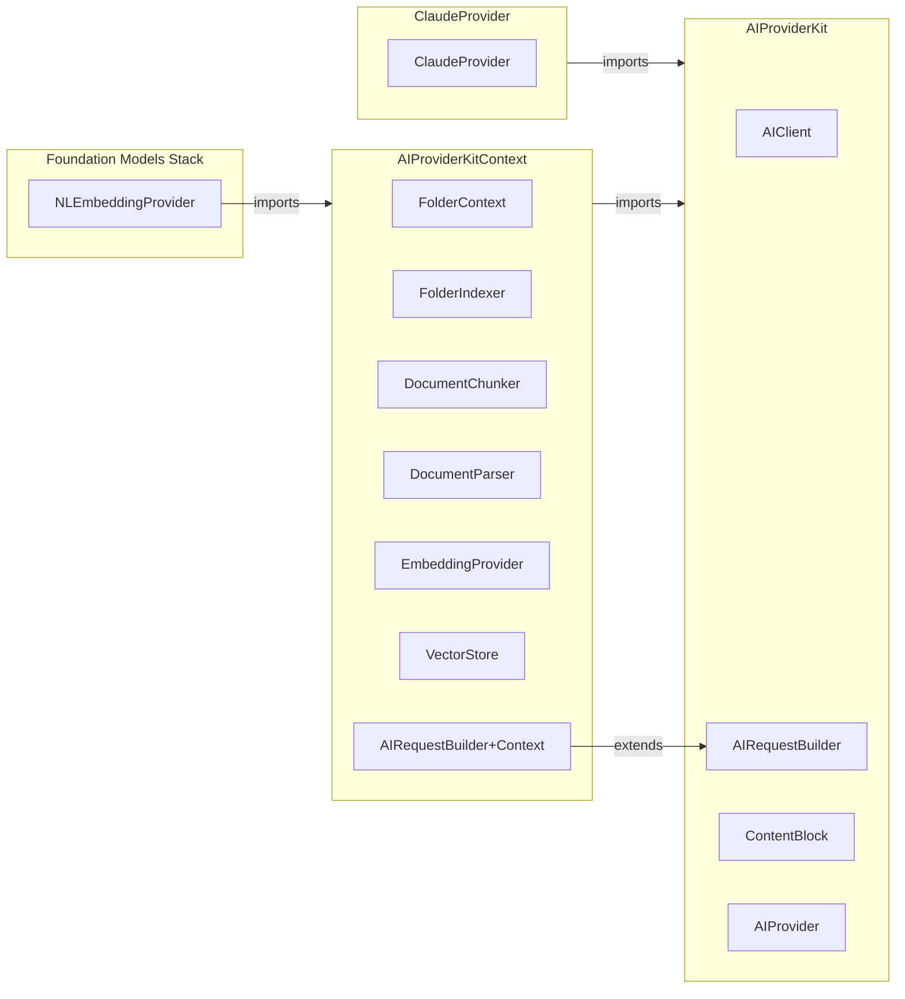

# Context: Folder-as-Context Support

## Contents

- [Problem Statement](#problem-statement)
- [Goals](#goals)
- [Proposed Architecture](#proposed-architecture)
  - [Layer Overview](#layer-overview)
  - [Indexing Pipeline](#indexing-pipeline)
  - [Retrieval & Injection Flow](#retrieval--injection-flow)
  - [Module Structure](#module-structure)
- [New Protocols and Types](#new-protocols-and-types)
  - [1. DocumentParser](#1-documentparser--file--text)
  - [2. DocumentChunker](#2-documentchunker--text--fixed-size-overlapping-chunks)
  - [3. EmbeddingProvider](#3-embeddingprovider--texts--float-vectors)
  - [4. VectorStore](#4-vectorstore--store-and-search-embeddings)
  - [5. RetrievalContext](#5-retrievalcontext--retrieved-chunks-ready-for-injection)
  - [6. FolderIndexer](#6-folderindexer--actor-that-owns-the-indexing-pipeline)
  - [7. FolderContext](#7-foldercontext--high-level-user-facing-entry-point)
  - [8. AIRequestBuilder extension](#8-airequestbuilder-extension--inject-retrievalcontext)
  - [9. contextWindowSize on AIProvider](#9-contextwindowsize-on-aiprovider)
- [Usage Example](#usage-example)
- [Incremental Indexing Example](#incremental-indexing-example)
- [Module Layout](#module-layout)
- [Open Questions](#open-questions)
- [Implementation Tasks](#implementation-tasks)
- [References](#references)

---

> **Status:** Proposed
> **Milestones:** 0.6.0 – 0.6.7 — Context
> **Relates to:** [`Documentation/Investigations/RAG-Providers.md`](../Investigations/RAG-Providers.md), [`ROADMAP.md`](../../ROADMAP.md#060--context-core-protocols--types)
> **Created:** 2026-03-12

---

## Problem Statement

`AIClient` currently has no way to ground a conversation in a local corpus of documents. Developers who want to build documentation assistants, code-aware chatbots, or knowledge-base Q&A apps must implement the entire retrieval pipeline themselves — chunking, embedding, nearest-neighbour search, and context injection — with no shared abstractions or conventions.

This issue proposes adding **folder-as-context** to `AIProviderKitContext`: a high-level API that accepts a directory URL, indexes its contents, and automatically injects the most relevant chunks into each `AIRequest`.

---

## Goals

- Point an `AIClient` at a local folder; the kit handles the rest.
- Provider-agnostic: works with `ClaudeProvider`, `OpenAIProvider`, and `FoundationModelProvider`.
- Strictly layered: each concern lives in its own protocol / type; nothing is coupled to a specific embedding backend or storage engine.
- Zero mandatory external dependencies in `AIProviderKit` core; all types live in the optional `AIProviderKitContext` library product.
- Full `Sendable` compliance and actor-based concurrency throughout (Swift 6).
- Token-budget awareness: auto-truncate injected chunks to the provider's context window.

---

## Proposed Architecture

### Layer Overview



### Indexing Pipeline



### Retrieval & Injection Flow



### Module Structure



---

## New Protocols and Types

### 1. `DocumentParser` — file → text

```swift
// AIProviderKitContext
public protocol DocumentParser: Sendable {
    /// File extensions this parser handles (e.g. ["md", "txt", "swift"])
    var supportedExtensions: Set<String> { get }

    /// Parse a file at `url` and return its textual content.
    /// May return multiple sections (e.g. one per PDF page).
    func parse(url: URL) async throws -> [String]
}

// Built-in implementations
public struct TextDocumentParser: DocumentParser { … }  // .txt .md .swift .json .yaml etc.
public struct PDFDocumentParser: DocumentParser { … }   // uses PDFKit (Apple platforms only)
```

**Design notes:**
- Returns `[String]` (not a single string) to let chunking be aware of natural page/section boundaries.
- Parsers are injected into `FolderIndexer`; callers can supply custom parsers for proprietary formats.
- `PDFDocumentParser` is guarded by `#if canImport(PDFKit)` so it compiles on all platforms.

---

### 2. `DocumentChunker` — text → fixed-size overlapping chunks

```swift
public struct DocumentChunker: Sendable {
    public let chunkSize: Int      // target size in characters (default: 512)
    public let overlap: Int        // overlap between adjacent chunks (default: 64)

    public func chunk(_ text: String, source: ChunkSource) -> [DocumentChunk]
}

public struct DocumentChunk: Sendable, Identifiable {
    public let id: UUID
    public let text: String
    public let source: ChunkSource   // file URL + chunk index, for citation
}

public struct ChunkSource: Sendable {
    public let fileURL: URL
    public let chunkIndex: Int
}
```

**Design notes:**
- Chunking splits on sentence/paragraph boundaries where possible to avoid mid-sentence cuts; falls back to hard character split.
- `ChunkSource` enables citation: callers can trace a retrieved chunk back to its source file.

---

### 3. `EmbeddingProvider` — texts → float vectors

```swift
public protocol EmbeddingProvider: Sendable {
    func embed(_ texts: [String]) async throws -> [[Float]]
}

public struct VoyageEmbeddingProvider: EmbeddingProvider {
    public init(apiKey: String, model: VoyageModel = .voyage3Large)
}

public struct OpenAIEmbeddingProvider: EmbeddingProvider {
    public init(apiKey: String, model: OpenAIEmbeddingModel = .textEmbedding3Large)
}

public struct NLEmbeddingProvider: EmbeddingProvider {
    // On-device; uses NaturalLanguage.NLEmbedding — no API key
    public init(language: NLLanguage = .english)
}
```

**Design notes:**
- `VoyageEmbeddingProvider` and `OpenAIEmbeddingProvider` reuse the same zero-dependency `URLSessionHTTPClient` already present in `ClaudeProvider`; no new networking code.
- `NLEmbeddingProvider` is recommended for `FoundationModelProvider` (fully on-device, fits the 3K token budget).

---

### 4. `VectorStore` — store and search embeddings

```swift
public protocol VectorStore: Sendable {
    func add(chunk: DocumentChunk, embedding: [Float]) async
    func search(query: [Float], topK: Int) async -> [ScoredChunk]
    func remove(fileURL: URL) async       // for incremental re-indexing
    func removeAll() async
}

public struct ScoredChunk: Sendable {
    public let chunk: DocumentChunk
    public let score: Float   // cosine similarity ∈ [-1, 1]
}

// Default implementation — zero dependencies, in-memory
public actor InMemoryVectorStore: VectorStore { … }
```

**Design notes:**
- Cosine similarity is computed with `vDSP` (Accelerate framework) where available; falls back to a pure-Swift implementation on Linux.
- `remove(fileURL:)` makes incremental re-indexing possible: when a file changes, remove its old chunks and re-index only that file.
- The `VectorStore` protocol allows a future `SQLiteVectorStore` (`sqlite-vec`) to drop in with zero call-site changes — planned post-1.0.

---

### 5. `RetrievalContext` — retrieved chunks ready for injection

```swift
public struct RetrievalContext: Sendable {
    public let chunks: [ScoredChunk]

    /// Total character count of all chunk texts (for token-budget estimation)
    public var totalLength: Int { chunks.reduce(0) { $0 + $1.chunk.text.count } }
}
```

---

### 6. `FolderIndexer` — actor that owns the indexing pipeline

```swift
public actor FolderIndexer {
    public init(
        embeddingProvider: any EmbeddingProvider,
        vectorStore: any VectorStore = InMemoryVectorStore(),
        parsers: [any DocumentParser] = FolderIndexer.defaultParsers,
        chunker: DocumentChunker = DocumentChunker()
    )

    /// Index all files in `url` (recursive). Skips hidden files and binary files.
    public func index(url: URL) async throws

    /// Re-index a single file (e.g. after it changes on disk).
    public func reindex(url: URL) async throws

    /// Embed `query` and return the top-K most relevant chunks.
    public func retrieve(for query: String, topK: Int = 5) async throws -> RetrievalContext

    /// Current indexing state
    public var state: IndexingState { get }  // .idle | .indexing(progress: Double) | .ready
}
```

**Design notes:**
- Embedding calls are batched (default batch size: 32) to minimise API round-trips.
- Files are indexed concurrently via `withThrowingTaskGroup`, bounded to 8 concurrent tasks to avoid memory pressure.
- A `lastModifiedDate` cache enables incremental re-indexing: files unchanged since the last pass are skipped.
- Emits `IndexingState.indexing(progress:)` updates so a SwiftUI view can show a progress indicator.

---

### 7. `FolderContext` — high-level, user-facing entry point

```swift
public struct FolderContextOptions: Sendable {
    public var chunkSize: Int = 512
    public var overlap: Int = 64
    public var topK: Int = 5
    public var fileExtensions: Set<String>? = nil  // nil = all supported types
    public var maxChunksPerFile: Int = 100
    public var tokenBudgetFraction: Double = 0.3   // fraction of provider context window to use
}

public actor FolderContext {
    public init(
        url: URL,
        embeddingProvider: any EmbeddingProvider,
        options: FolderContextOptions = FolderContextOptions()
    ) async throws

    /// Retrieve the most relevant chunks for `query`.
    public func retrieve(for query: String) async throws -> RetrievalContext

    /// Re-index the folder (e.g. call after files change).
    public func reindex() async throws

    /// Current state (mirrors FolderIndexer.state)
    public var state: IndexingState { get }
}
```

---

### 8. `AIRequestBuilder` extension — inject `RetrievalContext`

```swift
// Extension in AIProviderKitContext
public extension AIRequestBuilder {
    /// Injects retrieved chunks as `.text` ContentBlocks prepended to the
    /// first user message, formatted as a fenced context block.
    @discardableResult
    func context(_ context: RetrievalContext) -> Self
}
```

Injected format (invisible to end-users, visible to the model):

```
<context>
[1] (from: DocumentationGuide.md)
Swift 6 introduces strict concurrency checking…

[2] (from: Architecture.md)
AIClient is an actor that owns a ToolRegistry…
</context>

{{original user message}}
```

---

### 9. `contextWindowSize` on `AIProvider`

```swift
// AIProviderKit core — non-breaking addition
public protocol AIProvider: Sendable {
    // … existing …
    var contextWindowSize: Int { get }   // default implementation returns 200_000
}
```

`FolderContext` uses this to auto-trim injected chunks: it never injects more than `provider.contextWindowSize * options.tokenBudgetFraction` estimated tokens.

---

## Usage Example

```swift
import AIProviderKit
import ClaudeProvider
import AIProviderKitContext

// 1. Set up provider and client
let claude = ClaudeProvider(apiKey: "sk-ant-…")
let client = AIClient(provider: claude)

// 2. Index a local docs folder
let docsContext = try await FolderContext(
    url: Bundle.main.url(forResource: "Docs", withExtension: nil)!,
    embeddingProvider: VoyageEmbeddingProvider(apiKey: "pa-…"),
    options: FolderContextOptions(topK: 4)
)
// docsContext.state == .ready

// 3. Build a request with retrieved context
let userQuery = "How do I add a new provider?"
let retrieved = try await docsContext.retrieve(for: userQuery)

let request = try AIRequestBuilder()
    .model(.claudeSonnet4)
    .systemPrompt("You are a helpful documentation assistant.")
    .context(retrieved)                       // ← injects retrieved chunks
    .addMessage(.user(text: userQuery))
    .build()

let response = try await client.send(request)
print(response.text)
```

---

## Incremental Indexing Example

```swift
// Watch for file changes (app-level logic) then call:
try await docsContext.reindex()
```

---

## Module Layout

```
Sources/
└── AIProviderKitContext/
    ├── Chunking/
    │   ├── DocumentChunker.swift
    │   └── DocumentChunk.swift
    ├── Embedding/
    │   ├── EmbeddingProvider.swift          (protocol)
    │   ├── VoyageEmbeddingProvider.swift
    │   ├── OpenAIEmbeddingProvider.swift
    │   └── NLEmbeddingProvider.swift
    ├── Parsing/
    │   ├── DocumentParser.swift             (protocol)
    │   ├── TextDocumentParser.swift
    │   └── PDFDocumentParser.swift
    ├── Storage/
    │   ├── VectorStore.swift                (protocol)
    │   └── InMemoryVectorStore.swift
    ├── Index/
    │   ├── FolderIndexer.swift
    │   └── IndexingState.swift
    ├── Context/
    │   ├── FolderContext.swift
    │   ├── FolderContextOptions.swift
    │   └── RetrievalContext.swift
    └── Builder/
        └── AIRequestBuilder+Context.swift   (.context(_:) extension)
```

---

## Open Questions

| # | Question | Options | Recommendation |
|---|----------|---------|----------------|
| 1 | Should `EmbeddingProvider` live in `AIProviderKit` core or `AIProviderKitContext`? | Core (simpler imports) vs. Context-only (keeps core zero-dep) | **Context-only** — core must stay dependency-free |
| 2 | Vector store persistence between app launches? | In-memory only for 0.6.0 vs. ship a file-based store | **In-memory for 0.6.0**; `SQLiteVectorStore` post-1.0 |
| 3 | `contextWindowSize`: hard-code per model or let provider report dynamically? | Hard-coded map vs. protocol property | **Protocol property** with a sensible default (200K) |
| 4 | Auto-inject via `AIClient` or always manual via builder? | Automatic (register a `FolderContext` on `AIClient`) vs. manual (`.context(_:)` on builder) | **Manual** — keeps `AIClient` surface stable and injection explicit |
| 5 | Chunking strategy: character-based or token-based? | Character count (zero deps) vs. token count (needs a tokenizer per provider) | **Character-based for 0.6.0** with a `~4 chars/token` heuristic |
| 6 | Should `FolderContext` watch the directory for live changes? | Passive (manual `reindex()` call) vs. active (`FSEvents` / `kqueue`) | **Passive for 0.6.0**; active watching is a post-1.0 enhancement |

---

## Implementation Tasks

- [ ] **Core protocols & types** — `DocumentParser`, `DocumentChunker`, `DocumentChunk`, `ChunkSource`, `EmbeddingProvider`, `VectorStore`, `ScoredChunk`, `RetrievalContext`, `IndexingState`
- [ ] **`TextDocumentParser`** — handles `.txt`, `.md`, `.markdown`, `.swift`, `.json`, `.yaml`, `.yml`, `.xml`
- [ ] **`PDFDocumentParser`** — `#if canImport(PDFKit)` guard; one section per page
- [ ] **`InMemoryVectorStore`** — actor; cosine similarity via `vDSP` / pure-Swift fallback
- [ ] **`VoyageEmbeddingProvider`** — REST client for `api.voyageai.com/v1/embeddings`
- [ ] **`OpenAIEmbeddingProvider`** — REST client for `api.openai.com/v1/embeddings`
- [ ] **`NLEmbeddingProvider`** — wraps `NLEmbedding.currentRevision(for:).vector(for:)`; `#if canImport(NaturalLanguage)` guard
- [ ] **`FolderIndexer`** — actor; batch embedding, concurrent file processing, incremental re-index via mtime cache
- [ ] **`FolderContext`** — high-level actor wrapping `FolderIndexer`; token-budget auto-trim
- [ ] **`AIRequestBuilder+Context`** — `.context(_:)` extension injecting `<context>` block
- [ ] **`contextWindowSize`** on `AIProvider` protocol (with default implementation = 200 000)
- [ ] **`Package.swift`** — add `AIProviderKitContext` library product and target
- [ ] **Unit tests** — in-memory store, mock embedding provider, chunk injection verification, budget trimming, incremental re-index
- [ ] **Integration tests** — round-trip context query against real Claude API (requires `ANTHROPIC_API_KEY` + `VOYAGE_API_KEY`)
- [ ] **Documentation** — DocC articles for `FolderContext` quick start and custom parser guide

---

## References

- [`Documentation/Investigations/RAG-Providers.md`](../Investigations/RAG-Providers.md) — provider feasibility analysis
- [Voyage AI Embeddings API](https://platform.claude.com/docs/en/build-with-claude/embeddings)
- [OpenAI Embeddings API](https://platform.openai.com/docs/guides/embeddings)
- [Apple NLEmbedding](https://developer.apple.com/documentation/naturallanguage/nlembedding)
- [Apple TN3193: Managing context window](https://developer.apple.com/documentation/technotes/tn3193-managing-the-on-device-foundation-model-s-context-window)
