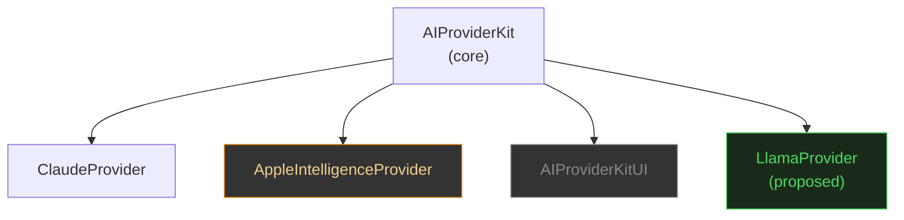
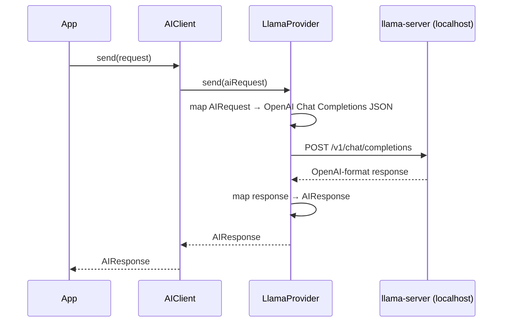

# Investigation: On-Device LLM for Non-Apple Platforms & Linux / Windows Compatibility

## Contents

- [Status](#status)
- [Problem Statement](#problem-statement)
- [Goals](#goals)
- [Current State of the Package](#current-state-of-the-package)
- [On-Device Inference Options for Non-Apple Platforms](#on-device-inference-options-for-non-apple-platforms)
  - [llama.cpp](#1-llamacpp)
  - [MLC LLM](#2-mlc-llm-machine-learning-compilation-for-llms)
  - [ONNX Runtime](#3-onnx-runtime)
  - [ExecuTorch](#4-executorch)
  - [LiteRT / MediaPipe](#5-litert--mediapipe)
  - [Summary Matrix](#summary-matrix)
- [Swift on Linux](#swift-on-linux)
  - [Compiler and SPM](#compiler-and-spm)
  - [Networking — URLSession Gap](#networking--urlsession-gap)
  - [Platform-Specific Frameworks](#platform-specific-frameworks)
  - [SwiftUI](#swiftui)
- [Swift on Windows](#swift-on-windows)
- [Impact Assessment per Package Target](#impact-assessment-per-package-target)
- [Proposed Paths Forward](#proposed-paths-forward)
  - [Path A — llama.cpp via Local REST Server (recommended)](#path-a--llamacpp-via-local-rest-server-recommended)
  - [Path B — llama.cpp via Native SPM Binary (Apple only)](#path-b--llamacpp-via-native-spm-binary-apple-only)
  - [Path C — MLC LLM via Local REST Server](#path-c--mlc-llm-via-local-rest-server)
  - [Path D — Linux / Windows ClaudeProvider port](#path-d--linux--windows-claudeprovider-port)
- [Open Questions](#open-questions)
- [Implementation Tasks (if approved)](#implementation-tasks-if-approved)
- [References](#references)

---

> **Status:** Investigation — no code changes proposed yet
> **Relates to:** [`ROADMAP.md`](../../ROADMAP.md) — "Beyond 1.0.0: Android / Linux support"
> **Created:** 2026-03-15

---

## Problem Statement

`AIProviderKit` is currently scoped to Apple platforms only (iOS 26+, macOS 26+, watchOS 11+, tvOS 26+, visionOS 2+). Two related questions have been raised:

1. **On-device LLM for non-Apple platforms**: The `AppleIntelligenceProvider` runs models locally on Apple Silicon via the Foundation Models framework. Is there an equivalent path for Linux or Windows using llama.cpp or another inference engine?

2. **Cross-platform compatibility**: Could the core `AIProviderKit` library — and possibly `ClaudeProvider` — be compiled and used on Linux or Windows as a server-side or CLI dependency?

This document captures all research findings, identifies feasibility blockers, and proposes concrete implementation paths.

---

## Goals

- Identify every viable on-device inference engine for non-Apple platforms and assess Swift/SPM integration readiness.
- Assess what would be required to make `AIProviderKit` and `ClaudeProvider` build on Linux and Windows.
- Document blockers with specificity so maintainers can make an informed prioritisation decision.
- Propose the lowest-friction paths with concrete implementation tasks.

---

## Current State of the Package

### Platform requirements (Package.swift)

```swift
platforms: [
    .iOS(.v26), .macOS(.v26), .watchOS(.v11), .tvOS(.v26), .visionOS(.v2)
]
```

All three library targets share this constraint. No Linux or Windows targets are declared.

### Providers today

| Provider | Mechanism | Platforms |
|---|---|---|
| `ClaudeProvider` | HTTPS REST via `URLSessionHTTPClient` | Apple only (URLSession) |
| `AppleIntelligenceProvider` | On-device `FoundationModels` framework | iOS 26+ / macOS 26+ (A17 Pro / M1+) |

### Platform-specific code

| File | API / Framework | Portable? |
|---|---|---|
| `CalendarTool.swift` | EventKit | Apple only |
| `RemindersTool.swift` | EventKit | Apple only |
| `LocationTool.swift` | CoreLocation | Apple only (guarded for tvOS) |
| `AILogger.swift` | `os.Logger` | Apple only |
| `AILogStore.swift` | `@Observable` | Requires `Observation` framework |
| `AIProviderKitUI/AILogView` | SwiftUI | Apple only |
| `AppleIntelligenceProvider/*` | `FoundationModels` | Guarded by `#if canImport(FoundationModels)` |

### CI/CD

The GitHub Actions workflow runs exclusively on `macos-26` runners. No Linux or Windows CI jobs exist.

---

## On-Device Inference Options for Non-Apple Platforms

### 1. llama.cpp

**Repository:** [ggml-org/llama.cpp](https://github.com/ggml-org/llama.cpp)

llama.cpp is the most widely used open-source local inference engine. The underlying C++ library is fully cross-platform. However, the Swift integration story is Apple-centric.

#### Platform support (the C/C++ binary)

| Platform | CPU | GPU Acceleration |
|---|---|---|
| macOS (Apple Silicon) | Yes | Metal (GPU + ANE) |
| macOS (Intel) | Yes | — |
| iOS / iPadOS | Yes (XCFramework) | Metal |
| Linux x86\_64 | Yes | CUDA, Vulkan, ROCm, SYCL |
| Linux ARM64 | Yes | CUDA, Vulkan |
| Windows 10/11 | Yes | CUDA, Vulkan |
| Android | Yes | Vulkan, OpenCL |

#### Swift/SPM integration — Apple platforms

Three viable approaches exist for Apple platforms:

**a. StanfordBDHG fork (cleanest for SPM consumers)**
[StanfordBDHG/llama.cpp](https://swiftpackageregistry.com/StanfordBDHG/llama.cpp) compiles llama.cpp into an XCFramework and exposes it as an SPM `binaryTarget`. This is semantically versioned and avoids the `unsafeFlags` problem present in the upstream `Package.swift`. It requires enabling Swift/C++ interop across the entire consumer dependency tree:

```swift
swiftSettings: [.interoperabilityMode(.Cxx)]
```

This has a significant implication: enabling C++ interoperability is a transitive requirement that affects every target importing the package.

**b. Official XCFramework binary from ggml-org releases**
The upstream [release page](https://github.com/ggml-org/llama.cpp/releases) ships `llama-vX.Y.Z-xcframework.zip` for Apple platforms. Usable as an SPM `binaryTarget` with no source compilation.

**c. Community Swift wrappers**
- [llama-cpp-swift](https://github.com/srgtuszy/llama-cpp-swift) — Swift 6-ready bindings
- [LLM.swift](https://github.com/eastriverlee/LLM.swift) — higher-level API, multi-platform Apple targets
- [LocalLLMClient](https://dev.to/tattn/localllmclient-a-swift-package-for-local-llms-using-llamacpp-and-mlx-1bcp) — unified backend supporting llama.cpp and Apple MLX (May 2025)
- [mattt/llama.swift](https://github.com/mattt/llama.swift) — semantically versioned access

#### Swift/SPM integration — Linux and Windows

**This is the critical gap.** There is an open GitHub issue ([#6574](https://github.com/ggml-org/llama.cpp/issues/6574)) requesting server-side Swift support that has been unresolved since 2024. The XCFramework binary targets are `arm64-apple-*` only; they do not build on Linux. The upstream `Package.swift` uses `unsafeFlags` and fails to compile via `swift build` on Linux due to Objective-C++ interop issues ([issue #10371](https://github.com/ggml-org/llama.cpp/issues/10371)).

**The only viable Linux/Windows path** is to run the `llama-server` process (llama.cpp's built-in HTTP server, shipped in official releases) and point an `AIProvider` at it via HTTP. `llama-server` exposes an OpenAI-compatible Chat Completions API at `http://localhost:8080/v1/chat/completions`.

#### Model format

llama.cpp uses the GGUF format with aggressive quantization (1.5–8 bit). A 7B parameter model runs in 4–8 GB RAM on CPU-only hardware — the primary use case for on-device inference on commodity Linux machines.

---

### 2. MLC LLM (Machine Learning Compilation for LLMs)

**Website:** [llm.mlc.ai](https://llm.mlc.ai)

MLC LLM is the most cross-platform of all evaluated options. It compiles model graphs via Apache TVM into optimised native code for each target backend.

| Platform | Inference | Swift API |
|---|---|---|
| macOS / iOS | Yes | Swift SDK exists |
| Linux (CUDA, Vulkan, CPU) | Yes | Python / REST only |
| Windows (CUDA, Vulkan, CPU) | Yes | Python / REST only |
| Android (OpenCL, Vulkan) | Yes | Kotlin / Java |
| Web (WebGPU / WASM) | Yes | JavaScript |

Like llama.cpp, MLC LLM exposes an OpenAI-compatible REST server (`mlc_llm serve`) on all platforms. The iOS Swift SDK is available and documented but is Apple-platform-only; on Linux/Windows the interface is Python or REST.

**Qualcomm** has published a tutorial for running MLC-LLM on Snapdragon-powered Windows machines, confirming ARM64 Windows viability.

---

### 3. ONNX Runtime

**Repository:** [microsoft/onnxruntime-swift-package-manager](https://github.com/microsoft/onnxruntime-swift-package-manager) (updated to ORT 1.24.2)

Microsoft maintains an official SPM package for ONNX Runtime. The Swift/ObjC API is **iOS/macOS-only** — it bridges via Objective-C to the underlying C++ runtime. There are no Swift bindings for Linux. A third-party [readdle/swift-onnxruntime](https://github.com/readdle/swift-onnxruntime) package also exists but remains Apple-only. On Linux and Windows, ONNX Runtime is used via C, Python, or Java APIs.

ONNX Runtime does not natively serve generative LLMs in the same way llama.cpp does; it is primarily a graph-execution runtime for ONNX-format models (classification, regression, traditional NLP tasks). Large generative models require the separate ONNX Runtime Generative AI extension.

---

### 4. ExecuTorch

**Repository:** [pytorch/executorch](https://github.com/pytorch/executorch) — available on the Swift Package Index

ExecuTorch ships as `executorch.xcframework` via SPM. A February 2025 RFC ([#8360](https://github.com/pytorch/executorch/issues/8360)) proposed expanding native ObjC/Swift bindings, indicating the API is still maturing. The SPM integration is Apple-platform-only (XNNPACK CPU, CoreML, MPS backends). ExecuTorch supports Android (Vulkan, XNNPACK) and Linux/Windows at the C++ level, but **no Swift bindings exist for those platforms**.

---

### 5. LiteRT / MediaPipe

Google's LiteRT (the successor to TensorFlow Lite) and MediaPipe LLM Inference API for iOS are distributed via CocoaPods (not SPM). Both are Apple-platform-only at the Swift/ObjC level. Google issued a deprecation notice for the MediaPipe LLM Inference API, directing users to LiteRT-LM. Neither supports Linux or Windows via Swift.

---

### Summary Matrix

| Engine | iOS Swift | macOS Swift | Linux Swift | Windows Swift | Best cross-platform path |
|---|---|---|---|---|---|
| **llama.cpp** | XCFramework | XCFramework | None | None | Local REST server (`llama-server`) |
| **MLC LLM** | Swift SDK | Swift SDK | None | None | Local REST server (`mlc_llm serve`) |
| **ONNX Runtime** | ObjC bridge | ObjC bridge | None | None | C / Python API only |
| **ExecuTorch** | SPM binary | SPM binary | None | None | C++ API only |
| **LiteRT / MediaPipe** | CocoaPods | CocoaPods | None | None | Python / C API only |
| **Apple MLX** | Apple Silicon | Apple Silicon | None | None | Not applicable |
| **Foundation Models** | A17 Pro / M1+ | M1+ | None | None | Apple-only by definition |

**Key insight:** No on-device inference engine currently provides a native Swift API for Linux or Windows. The universal pattern for cross-platform coverage is wrapping a local HTTP server that exposes an OpenAI-compatible endpoint.

---

## Swift on Linux

### Compiler and SPM

Swift is production-ready on Linux. Swift 6.1 (March 2025) officially supports:

- Ubuntu 20.04, 22.04, 24.04
- Fedora (added in Swift 6)
- Architectures: x86\_64, ARM64
- Swift Package Manager: fully supported
- Static Linux SDK: supported in Swift 6 (fully statically linked executables, ideal for containers; cross-compilation from macOS)

Server-side Swift is production-proven at major companies. The Swift Server Work Group is active.

### Networking — URLSession Gap

This is the most impactful blocker for porting `ClaudeProvider` to Linux.

| API | Linux status |
|---|---|
| `import Foundation` | Requires `import FoundationNetworking` separately |
| `URLSession.shared.data(for:)` (async) | **Not fully implemented** — completion-handler-based APIs work but require `withCheckedContinuation` bridging |
| `URLSession.webSocketTask` | Not implemented |
| Static Linux SDK + URLSession | SSL linking failures ([swift-corelibs-foundation #5092](https://github.com/swiftlang/swift-corelibs-foundation/issues/5092)) |

The community and Swift Server Work Group recommendation for production Linux networking is [AsyncHTTPClient](https://github.com/swift-server/async-http-client) (SwiftNIO-backed) instead of URLSession. This would require `ClaudeProvider` to abstract its HTTP client behind the existing `HTTPClient` protocol with a second implementation (`AsyncHTTPClientAdapter`).

The `HTTPClient` protocol already exists in `ClaudeProvider/Networking/HTTPClient.swift` — the abstraction is already in place. A Linux implementation would implement this same protocol using AsyncHTTPClient without touching any mapper or provider logic.

### Platform-Specific Frameworks

The following `AIProviderKit` components use Apple-only frameworks and would need to be excluded from any cross-platform build:

| Component | Framework | Required action |
|---|---|---|
| `CalendarTool` | EventKit | Wrap with `#if canImport(EventKit)` |
| `RemindersTool` | EventKit | Wrap with `#if canImport(EventKit)` |
| `LocationTool` | CoreLocation | Wrap with `#if canImport(CoreLocation)` |
| `AILogger` | `os.Logger` | Replace with `swift-log` on Linux |
| `AILogStore` | `@Observable` | Requires `Observation` framework |

The `Observation` framework (`@Observable`) is available on Linux since Swift 5.9; this is not a blocker.

`os.Logger` is Apple-only. The `AILogger` would need to conditionally import `swift-log` on Linux. This would add a dependency to `AIProviderKit` (currently zero external dependencies) unless `os.Logger` is abstracted behind a protocol first.

### SwiftUI

SwiftUI is unavailable on Linux. `AIProviderKitUI` (`AILogView`) must remain Apple-platform-only. In a cross-platform build, it must be excluded entirely or its target must declare explicit platform constraints that exclude Linux.

---

## Swift on Windows

Swift on Windows is production-ready for CLI and server-side workloads (as of Swift 6.1+). Prebuilt toolchains are available for ARM64 Windows (added in Swift 6). VS Code with the official Swift extension provides full IDE support.

**Key limitations for this project:**

| Feature | Windows status |
|---|---|
| Swift compiler / SPM | Full support |
| SwiftUI | Not available |
| URLSession async/await | Partial (same issues as Linux) |
| SwiftNIO for Windows | Still maturing as of mid-2025 ([Swift Forums](https://forums.swift.org/t/mid-year-2025-swiftnio-for-windows-status/81143)) |
| Concurrency inspection (`swift-inspect`) | Not available |
| EventKit / CoreLocation | Not available |
| `os.Logger` | Not available |
| 64k DLL symbol limit | Engineering constraint for large targets |

The SwiftNIO maturity gap is notable because AsyncHTTPClient (the recommended URLSession replacement for Linux) depends on SwiftNIO. If Windows support is a goal, this dependency would need to be monitored or worked around.

---

## Impact Assessment per Package Target



| Target | Linux | Windows | Blocker |
|---|---|---|---|
| `AIProviderKit` (core protocols, models, registries) | Mostly portable | Mostly portable | `os.Logger` in `AILogger`; built-in tools require EventKit / CoreLocation guards |
| `ClaudeProvider` | Requires HTTP client swap | Requires HTTP client swap + SwiftNIO | `URLSessionHTTPClient` not viable on Linux/Windows |
| `AppleIntelligenceProvider` | Not portable | Not portable | `FoundationModels` is Apple-only by definition |
| `AIProviderKitUI` | Not portable | Not portable | SwiftUI unavailable |
| `LlamaProvider` (proposed) | Portable (REST mode) | Portable (REST mode) | No native Swift bindings; REST server required |

---

## Proposed Paths Forward

### Path A — llama.cpp via Local REST Server (recommended)

**Description:** A new `LlamaProvider` library target implements `AIProvider` (and optionally `StreamableProvider`) by communicating with a locally-running `llama-server` process via its OpenAI-compatible HTTP API. The user is responsible for starting `llama-server` before calling `AIClient`.

**Why this is the best cross-platform path:**
- Works identically on macOS, Linux, and Windows — no platform-specific Swift code in the provider itself
- No C++ interop, no unsafe flags, no SPM binary target complications
- The `HTTPClient` protocol abstraction in `ClaudeProvider` is a direct precedent — the same pattern applies
- `llama-server` is distributed in official llama.cpp releases for all platforms
- Follows the same provider pattern as `ClaudeProvider` (request mapper + response mapper + HTTP client)

**Approach:**



**Configuration:**
```swift
let provider = LlamaProvider(
    baseURL: URL(string: "http://localhost:8080")!,
    model: .llama3_2_3b  // or any GGUF model loaded by llama-server
)
```

**SPM target:** New `LlamaProvider` library target in `Package.swift`. Zero additional dependencies on Apple platforms. On Linux, requires a `AsyncHTTPClient`-backed `HTTPClient` implementation (see Path D).

**Streaming:** `llama-server` supports SSE streaming via the OpenAI `stream: true` parameter. `StreamableProvider` conformance is feasible.

**Tool use:** `llama-server` supports OpenAI-format function calling with compatible models (Llama 3.1+, Mistral, etc.). `ContentBlock.toolUse` mapping follows the same pattern as `ClaudeProvider`.

**Limitation:** The user must manage the `llama-server` process lifecycle. This is intentional — process management is out of scope for a networking library.

---

### Path B — llama.cpp via Native SPM Binary (Apple only)

**Description:** A new `LlamaProviderNative` library target uses the StanfordBDHG XCFramework or official ggml-org XCFramework to run inference in-process on Apple platforms.

**Why this is secondary to Path A:**
- Requires enabling Swift/C++ interoperability (`swiftSettings: [.interoperabilityMode(.Cxx)]`) across the entire dependency graph — this is a breaking, transitive requirement for all consumers
- Apple-platform-only (no Linux/Windows benefit)
- Binary size increases significantly
- Does not solve the original cross-platform investigation goal
- `AppleIntelligenceProvider` already provides on-device inference for Apple platforms

This path has value only if users specifically need llama.cpp's GGUF model ecosystem on Apple while preferring to avoid `FoundationModels` (e.g., using models not supported by Apple's on-device model, or targeting macOS 14/15 where `FoundationModels` is unavailable).

---

### Path C — MLC LLM via Local REST Server

Structurally identical to Path A but backed by `mlc_llm serve`. The `LlamaProvider` in Path A could support both `llama-server` and MLC LLM via configuration, since both expose OpenAI-compatible endpoints. Alternatively, a separate `MLCProvider` target could be added.

MLC LLM is particularly relevant for Windows on Qualcomm Snapdragon (ARM64 + Hexagon NPU), a growing category of devices without NVIDIA GPUs.

---

### Path D — Linux / Windows ClaudeProvider port

**Description:** Make `ClaudeProvider` compile on Linux (and potentially Windows) by replacing `URLSessionHTTPClient` with a platform-conditional implementation.

**Required changes:**
1. **`Package.swift`** — Remove `platforms` constraint from `AIProviderKit` and `ClaudeProvider` targets (keep it on `AppleIntelligenceProvider`, `AIProviderKitUI`, and built-in tools)
2. **`ClaudeProvider/Networking/`** — Add `AsyncHTTPClientAdapter` conforming to the existing `HTTPClient` protocol, conditionally compiled on Linux
3. **`AIProviderKit/Tools/`** — Wrap `CalendarTool`, `RemindersTool`, `LocationTool` in `#if canImport(EventKit)` / `#if canImport(CoreLocation)` guards
4. **`AIProviderKit/Logging/AILogger.swift`** — Conditionally use `os.Logger` on Apple; fall back to `swift-log` or `print` on Linux (adds a dependency or reduces logging capability)
5. **`Package.swift`** — Add `AsyncHTTPClient` as a conditional dependency (Linux/Windows only) or as a separate optional target

**`LlamaProvider` from Path A** would automatically benefit from Path D's networking fix on Linux.

---

## Open Questions

1. **C++ interop appetite**: Is enabling `swiftSettings: [.interoperabilityMode(.Cxx)]` across all consumers acceptable? This would be required for Path B (native llama.cpp) and would affect every downstream package that imports `AIProviderKit`.

2. **`os.Logger` abstraction**: Should `AILogger` be refactored to use `swift-log` universally (adding a dependency but gaining Linux/Windows support), or should it remain `os.Logger` on Apple with a no-op fallback on other platforms?

3. **Process lifecycle management**: For Path A (llama-server), should the library provide optional process-management utilities (start/stop `llama-server`, health-check polling), or should this remain strictly out of scope?

4. **Model download**: GGUF model files are 2–70 GB. Is a model-management abstraction in scope for this library, or should it document model setup externally?

5. **Minimum hardware for on-device Linux**: What is the expected deployment context? (Raspberry Pi 5 with 8 GB RAM can run a 7B Q4 model; cloud VMs with NVIDIA GPUs can run 70B models via CUDA). The answer affects which quantizations and backends to document.

6. **Windows priority**: Given that SwiftNIO on Windows is still maturing, should Windows support be deferred until SwiftNIO stabilises, or should it be parallelised?

7. **CI/CD**: Linux support requires adding Ubuntu runners to the GitHub Actions workflow. Should a matrix strategy be introduced (macOS + Ubuntu) or should Linux be a separate optional workflow?

---

## Implementation Tasks (if approved)

Tasks are ordered by dependency and grouped by path.

### Prerequisite (Path D / shared foundation)

- [ ] Remove `platforms` declaration from `AIProviderKit` and `ClaudeProvider` targets in `Package.swift`; add it explicitly only to `AppleIntelligenceProvider`, `AIProviderKitUI`, `CalendarTool`, `RemindersTool`, `LocationTool`
- [ ] Add `#if canImport(EventKit)` guards around `CalendarTool` and `RemindersTool`
- [ ] Add `#if canImport(CoreLocation)` guard around `LocationTool`
- [ ] Audit `AILogger.swift` for `os.Logger` usage; implement a `#if canImport(os)` conditional with a `print`-based fallback for Linux
- [ ] Add a `LinuxHTTPClient.swift` implementing the `HTTPClient` protocol using `AsyncHTTPClient` (guarded by `#if os(Linux)`)
- [ ] Update `Package.swift` to conditionally depend on `swift-server/async-http-client` on Linux
- [ ] Update `ClaudeProvider` initialiser to select the appropriate `HTTPClient` implementation at runtime based on platform
- [ ] Add Ubuntu 24.04 runner to GitHub Actions CI matrix
- [ ] Verify `swift build` and `swift test` pass on Linux for `AIProviderKitTests` and `ClaudeProviderTests`

### Path A — LlamaProvider (REST)

- [ ] Add `LlamaProvider` library product and target in `Package.swift`
- [ ] Define `LlamaRequestMapper` — maps `AIRequest` → OpenAI Chat Completions JSON (`/v1/chat/completions`)
- [ ] Define `LlamaResponseMapper` — maps OpenAI response JSON → `AIResponse`; maps SSE deltas → `AIStreamEvent`
- [ ] Implement `LlamaProvider` conforming to `StreamableProvider`; configurable `baseURL` and default model
- [ ] Extend `AIModel` with llama.cpp community model constants (e.g., `.llama3_2_3b`, `.llama3_1_8b`, `.mistral7b`)
- [ ] Add `MockHTTPClient`-based unit tests (`LlamaProviderTests` target)
- [ ] Add integration test suite for `LlamaProvider` (requires a running `llama-server` — document setup in `Documentation/IntegrationTests.md`)
- [ ] Document `llama-server` setup in `README.md` and a new `Documentation/LlamaProvider.md`

### Path B — LlamaProviderNative (Apple only, optional)

- [ ] Evaluate C++ interop cost on all existing consumers before proceeding
- [ ] Add `LlamaProviderNative` target with `binaryTarget` dependency on StanfordBDHG XCFramework
- [ ] Add `LlamaNativeRequestHandler` (replaces HTTP with direct C++ API calls)
- [ ] Gate target with explicit `platforms: [.iOS(.v17), .macOS(.v14)]` (enabling older Apple OS support vs `AppleIntelligenceProvider`'s iOS 26 requirement)

---

## References

### llama.cpp
- [ggml-org/llama.cpp — Swift Package Index](https://swiftpackageindex.com/ggml-org/llama.cpp)
- [StanfordBDHG/llama.cpp — Swift Package Registry](https://swiftpackageregistry.com/StanfordBDHG/llama.cpp)
- [llama.cpp build docs (platform/backend matrix)](https://github.com/ggml-org/llama.cpp/blob/master/docs/build.md)
- [llama.cpp server-side Swift request #6574](https://github.com/ggml-org/llama.cpp/issues/6574)
- [llama.cpp ObjC++ SPM compilation issue #10371](https://github.com/ggml-org/llama.cpp/issues/10371)
- [llama-cpp-swift (Swift 6-ready bindings)](https://github.com/srgtuszy/llama-cpp-swift)
- [LocalLLMClient: unified llama.cpp + MLX backend](https://dev.to/tattn/localllmclient-a-swift-package-for-local-llms-using-llamacpp-and-mlx-1bcp)

### MLC LLM
- [MLC LLM home](https://llm.mlc.ai/)
- [MLC LLM iOS Swift SDK docs](https://llm.mlc.ai/docs/deploy/ios.html)
- [MLC LLM on Windows/Snapdragon (Qualcomm tutorial)](https://www.qualcomm.com/developer/blog/2025/02/how-to-run-deepseek-windows-snapdragon-tutorial-llama-cpp-mlc-llm)

### ONNX Runtime / ExecuTorch / LiteRT
- [microsoft/onnxruntime-swift-package-manager](https://github.com/microsoft/onnxruntime-swift-package-manager)
- [ExecuTorch — Swift Package Index](https://swiftpackageindex.com/pytorch/executorch)
- [ExecuTorch RFC: ObjC/Swift bindings #8360](https://github.com/pytorch/executorch/issues/8360)
- [LiteRT iOS quickstart](https://ai.google.dev/edge/litert/ios/quickstart)

### Swift on Linux / Windows
- [Swift platform support matrix](https://www.swift.org/platform-support/)
- [What's new in Swift: December 2025](https://www.swift.org/blog/whats-new-in-swift-december-2025/)
- [URLSession not usable with Static Linux SDK #5092](https://github.com/swiftlang/swift-corelibs-foundation/issues/5092)
- [URLSession missing from Static Linux SDK #5089](https://github.com/swiftlang/swift-corelibs-foundation/issues/5089)
- [SwiftNIO for Windows mid-2025 status (Swift Forums)](https://forums.swift.org/t/mid-year-2025-swiftnio-for-windows-status/81143)
- [swift-server/async-http-client](https://github.com/swift-server/async-http-client)
- [Swift 6.1.1 for Linux and Windows](https://forums.swift.org/t/development-open-for-swift-6-1-1-for-linux-and-windows/79152)

### Apple Foundation Models
- [Foundation Models — Apple Developer Documentation](https://developer.apple.com/documentation/FoundationModels)
- [WWDC25: Meet the Foundation Models framework (session 286)](https://developer.apple.com/videos/play/wwdc2025/286/)
- [Apple Foundation Models 2025 updates — Apple ML Research](https://machinelearning.apple.com/research/apple-foundation-models-2025-updates)
