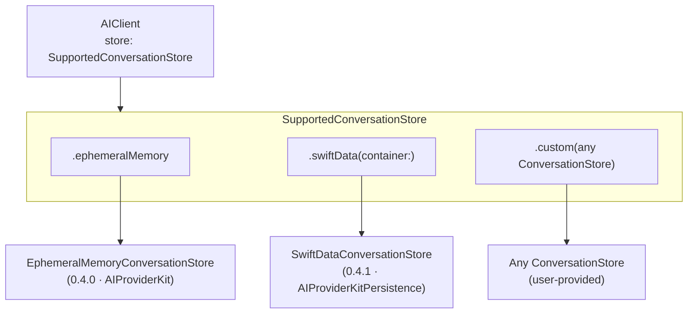

# Persistence Layer Design (0.4.0 – 0.4.1)

## Contents

- [Overview](#overview)
- [Architecture](#architecture)
- [0.4.0 — Core Protocol & In-Memory](#040--core-protocol--in-memory)
- [0.4.1 — SwiftData Backend](#041--swiftdata-backend)

> **Status:** Complete
> **Milestones:** 0.4.0 ✓ · 0.4.1 ✓
> **Created:** 2026-03-12

## Overview

The persistence layer is **fully modular and swappable**. A single `SupportedConversationStore` enum selects and configures the backend at `AIClient` initialisation time — swapping storage is a one-line change with no other code modifications required.

```swift
// Ephemeral in-memory (default, zero dependencies)
let client = AIClient(provider: claude, store: .ephemeralMemory)

// SwiftData (querying, indexing, multi-process — import AIProviderKitPersistence)
let container = try ModelContainer(for: ConversationRecord.self, ConversationTurnRecord.self)
let client = AIClient(provider: claude, store: .swiftData(container: container))

// Custom backend (bring your own ConversationStore implementation)
let client = AIClient(provider: claude, store: .custom(myStore))
```

Each case resolves internally to a concrete type conforming to `ConversationStore`. Callers never reference those types directly — only the enum case and the shared protocol surface are public API.

## Architecture



## 0.4.0 — Core Protocol & In-Memory ✓

Establishes the persistence contract and a zero-dependency default backend. All higher-level `AIClient` APIs are introduced here; 0.4.1 adds the SwiftData backend without changing any call sites.

- `ConversationStore` protocol — provider-agnostic async CRUD for conversations and turns
- `SupportedConversationStore` enum — `.ephemeralMemory` / `.custom` / `.swiftData` cases
- `Conversation` / `ConversationTurn` models — `Codable`, `Identifiable`, timestamped
- `EphemeralMemoryConversationStore` — backing type for `.ephemeralMemory`, zero dependencies
- `AIClient` init — `store: SupportedConversationStore = .ephemeralMemory` parameter
- `AIClient` — `send(conversation:message:)` overload that auto-loads and auto-saves turns
- Conversation management API — list, load, delete, archive
- Token-budget trimming — prune oldest turns when context limit is approached

## 0.4.1 — SwiftData Backend ✓

SwiftData-backed store for apps that need persistent storage, querying, and multi-process access. Ships as `AIProviderKitPersistence`; importing it unlocks the `.swiftData(container:)` convenience factory on `SupportedConversationStore`.

- `SwiftDataConversationStore` — `@ModelActor`-based store conforming to `ConversationStore`
- Injectable `ModelContainer` — callers provide their own container at init time
- `ConversationRecord` / `ConversationTurnRecord` — SwiftData `@Model` classes with `Codable` message blobs
- `.custom(any ConversationStore)` case — enables backend module injection without circular dependencies
- `.swiftData(container:)` convenience factory — one-line store selection
- `.chat` export / import — portable JSON files with `.chat` extension; single and bulk operations
- 22 unit tests — in-memory `ModelContainer` for test isolation
