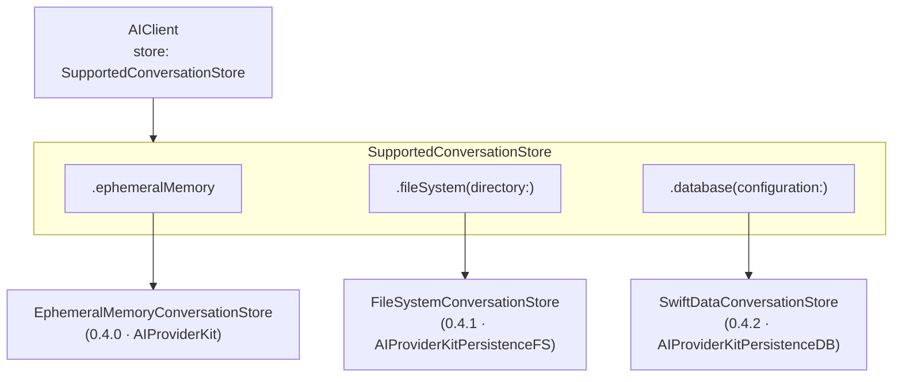

# Persistence Layer Design (0.4.0 – 0.4.2)

## Contents

- [Overview](#overview)
- [Architecture](#architecture)
- [0.4.0 — Core Protocol & In-Memory](#040--core-protocol--in-memory)
- [0.4.1 — File System Backend](#041--file-system-backend)
- [0.4.2 — Database Backend](#042--database-backend)

> **Status:** Planned
> **Milestones:** 0.4.0 · 0.4.1 · 0.4.2
> **Created:** 2026-03-12

## Overview

The persistence layer is **fully modular and swappable**. A single `SupportedConversationStore` enum selects and configures the backend at `AIClient` initialisation time — swapping storage is a one-line change with no other code modifications required.

```swift
// Ephemeral in-memory (default, zero dependencies)
let client = AIClient(provider: claude, store: .ephemeralMemory)

// File system (cross-platform, no extra frameworks)
let client = AIClient(provider: claude, store: .fileSystem(directory: .applicationSupport))

// Database — SwiftData (querying, migrations, multi-process)
let client = AIClient(provider: claude, store: .database(configuration: ModelConfiguration("Conversations")))
```

Each case resolves internally to a concrete type conforming to `ConversationStore`. Callers never reference those types directly — only the enum case and the shared protocol surface are public API.

## Architecture



## 0.4.0 — Core Protocol & In-Memory

Establishes the persistence contract and a zero-dependency default backend. All higher-level `AIClient` APIs are introduced here; `0.4.1` and `0.4.2` add new backend cases without changing any call sites.

- `ConversationStore` protocol — provider-agnostic async CRUD for conversations and turns
- `SupportedConversationStore` enum — `.ephemeralMemory` / `.fileSystem` / `.database` cases
- `Conversation` / `ConversationTurn` models — `Codable`, `Identifiable`, timestamped
- `EphemeralMemoryConversationStore` — backing type for `.ephemeralMemory`, zero dependencies
- `AIClient` init — `store: SupportedConversationStore = .ephemeralMemory` parameter
- `AIClient` — `send(conversationId:message:model:)` overload that auto-loads and auto-saves turns
- Conversation management API — list, load, delete, archive
- Token-budget trimming — prune oldest turns when context limit is approached

## 0.4.1 — File System Backend

Works on every Apple platform and Linux without any additional frameworks. Ships as `AIProviderKitPersistenceFS`; importing it unlocks the `.fileSystem` case on `SupportedConversationStore`.

- `FileSystemConversationStore` — backing type for `.fileSystem(directory:)`
- Atomic writes — write to temp file, rename on success, no partial-write corruption
- Async I/O — file operations offloaded off the calling actor, never blocking
- Conversation index file — fast list / search without loading all turn payloads
- Import / export — portable conversation JSON bundles

## 0.4.2 — Database Backend

SwiftData-backed store for apps that need querying, indexing, or multi-process access. Ships as `AIProviderKitPersistenceDB`; importing it unlocks the `.database` case on `SupportedConversationStore`.

- `SwiftDataConversationStore` — backing type for `.database(configuration:)` (iOS 17+ / macOS 14+)
- Schema migrations — versioned `ModelContainer` configuration
- Predicate-based search — query conversations by date, provider, model, or metadata
- `AIProviderKitUI` — conversation history list view backed by `@Query`
- Migration utilities — import `FileSystemConversationStore` data into SwiftData
