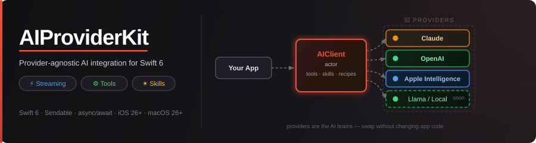

<p align="center">
  
</p>

<p align="center">
  <a href="https://github.com/molayab/swift-ai-provider-kit/actions/workflows/ci.yml"></a>
  
  
  
</p>

A modular Swift package for integrating AI providers in a provider-agnostic way. Swap between Claude, OpenAI, or on-device models without changing application code, with built-in streaming, automatic tool execution, reusable prompt templates, and composable skills.

Built with Swift 6, full `Sendable` compliance, and SOLID principles throughout.

---

## Features

| Feature | Description |
|---|---|
| **Provider abstraction** | Swap providers without changing application code |
| **Automatic tool execution** | The client executes tool calls and follows up automatically |
| **Streaming** | Server-sent event streaming via `AsyncThrowingStream` |
| **Recipes** | Reusable `{{placeholder}}` prompt templates |
| **Skills** | Composable capabilities (tools + recipe + post-processing) |
| **Registries** | Thread-safe `actor`-based stores for tools, skills, and recipes |
| **Structured logging** | `os.Logger`-backed `AILogger` with optional in-app `AILogView` |
| **Predefined tools** | Location, Calendar, and Reminders tools ready to use |

---

## Installation

### Swift Package Manager

```swift
dependencies: [
    .package(url: "https://github.com/molayab/swift-ai-provider-kit.git", from: "0.1.0")
]
```

Add the products you need:

```swift
.product(name: "AIProviderKit",   package: "AIProviderKit"),   // Core
.product(name: "ClaudeProvider",  package: "AIProviderKit"),   // Claude (Anthropic)
.product(name: "AIProviderKitUI", package: "AIProviderKit"),   // SwiftUI log viewer (optional)
```

---

## Quick Start

```swift
import AIProviderKit
import ClaudeProvider

let client = AIClient(
    provider: ClaudeProvider(
        authorization: APIKeyAuthorization(apiKey: "sk-ant-..."),
        logger: AILogger(subsystem: "com.myapp", category: "ai")
    )
)

let response = try await client.send(
    AIRequestBuilder()
        .model(.claudeSonnet4)
        .systemPrompt("You are a helpful assistant.")
        .addMessage(.user(text: "What is the capital of France?"))
        .build()
)
print(response.text)
```

---

## Examples

Full, copy-paste ready examples are in the [`Examples/`](Examples/) folder.

| File | What it shows |
|---|---|
| [`01_BasicChat.swift`](Examples/01_BasicChat.swift) | Single-turn and multi-turn conversation |
| [`02_StreamingChat.swift`](Examples/02_StreamingChat.swift) | SSE streaming integrated into a SwiftUI `@Observable` view model |
| [`03_ToolUse.swift`](Examples/03_ToolUse.swift) | Custom tools + predefined `CalendarTool` / `LocationTool`, auto-execution loop |
| [`04_RecipesAndSkills.swift`](Examples/04_RecipesAndSkills.swift) | Reusable prompt templates and composable Skills |
| [`05_LoggingSetup.swift`](Examples/05_LoggingSetup.swift) | `AILogStore` + `AILogView` debug sheet in a SwiftUI app |

### Streaming

```swift
for try await event in client.stream(request) {
    if case .textDelta(let chunk) = event {
        output += chunk
    }
}
```

### Tool use

```swift
// 1. Register tools
await client.toolRegistry.register(LocationTool.make())
await client.toolRegistry.registerAll(CalendarTool.self)

// 2. Send — tool calls are executed and followed up automatically
let response = try await client.send(
    AIRequestBuilder()
        .model(.claudeSonnet4)
        .tools(await client.toolRegistry.allTools)
        .addMessage(.user(text: "What events do I have near me this week?"))
        .build()
)
print(response.text)
```

---

## Architecture

```
AIProviderKit          Core protocols, models, builders, registries, client
ClaudeProvider         Anthropic Messages API implementation
AIProviderKitUI        SwiftUI log viewer (optional dependency)
```

See [`Documentation/Architecture.md`](Documentation/Architecture.md) for full class diagrams and sequence diagrams.

### Key types

| Type | Role |
|---|---|
| `AIClient` | Main entry point (actor). Orchestrates the provider, registries, and auto tool-execution loop. |
| `AIProvider` | Protocol every provider implements. |
| `StreamableProvider` | Extends `AIProvider` with SSE streaming. |
| `AIRequestBuilder` | Fluent, validated request construction. |
| `Tool` / `ToolGroup` | A callable function (or group of functions) the model can invoke. |
| `Recipe` | A `{{placeholder}}` prompt template. |
| `Skill` | A bundle of tools + recipe + post-processing logic. |
| `AILogger` | Wraps `os.Logger`; optionally forwards entries to `AILogStore`. |
| `AILogView` | SwiftUI view showing live log entries from `AILogStore`. |

---

## Tools

Register predefined tools or define your own:

```swift
// Predefined — bulk-register an entire ToolGroup
await client.toolRegistry.register(LocationTool.make())
await client.toolRegistry.registerAll(CalendarTool.self)
await client.toolRegistry.registerAll(RemindersTool.self)

// Custom
let myTool = Tool(
    name: "search_products",
    description: "Searches the product catalog.",
    inputSchema: .object(
        properties: ["query": .string(description: "Search query.")],
        required: ["query"]
    )
) { input async throws in
    let query = input["query"]?.stringValue ?? ""
    let results = try await ProductService.search(query)
    return .array(results.map { .string($0.name) })
}
await client.toolRegistry.register(myTool)
```

---

## Recipes

```swift
let recipe = Recipe(
    id: "summarize",
    name: "Summarizer",
    systemPrompt: "You are a concise summarizer.",
    userPromptTemplate: "Summarize in {{style}} style:\n\n{{text}}"
)
await client.recipeRegistry.register(recipe)

let response = try await client.send(
    recipe: recipe,
    values: ["style": "bullet points", "text": articleBody],
    model: .claudeSonnet4
)
```

---

## Logging

```swift
// Enable in-app log capture at startup
AILogStore.shared = AILogStore()

// Attach a logger to the provider
let logger = AILogger(subsystem: Bundle.main.bundleIdentifier ?? "app", category: "ai")
let provider = ClaudeProvider(authorization: auth, logger: logger)

// Show the log viewer in a debug sheet (import AIProviderKitUI)
.sheet(isPresented: $showLogs) {
    AILogView(store: AILogStore.shared ?? AILogStore())
}
```

All log entries are also written to the system log and visible in **Console.app**.

---

## Use Cases

Detailed use cases with code examples are in [`Documentation/UseCases.md`](Documentation/UseCases.md):

| ID | Scenario | Status |
|---|---|---|
| UC-01 | Simple text conversation | ✅ 0.1.0 |
| UC-02 | Multi-turn conversation | ✅ 0.1.0 |
| UC-03 | Streaming response | ✅ 0.1.0 |
| UC-04 | Automatic tool use | ✅ 0.1.0 |
| UC-05 | Recipe (prompt template) | ✅ 0.1.0 |
| UC-06 | Skill execution | ✅ 0.1.0 |
| UC-07 | In-app log viewer | ✅ 0.1.0 |
| UC-08 | Vision (image input) | ✅ 0.1.0 |
| UC-09 | Custom tool definition | ✅ 0.1.0 |
| UC-10 | Provider swap | ✅ 0.1.0 |
| UC-11 | Ephemeral conversation store | 🔜 0.4.0 |
| UC-12 | File system persistence | 🔜 0.5.0 |
| UC-13 | SwiftData persistence | 🔜 0.6.0 |

---

## Extending

### Add a new provider

Implement `AIProvider` (and optionally `StreamableProvider`) — `AIClient` works with any conforming type. See [`Documentation/AddingAProvider.md`](Documentation/AddingAProvider.md) for a step-by-step walkthrough.

### CI / GitHub Actions

Every push and pull request to `main` runs two required checks — both must pass before a branch can be merged:

| Check | What it does |
|---|---|
| **SwiftLint** | `swiftlint lint --strict` — zero violations required |
| **Build & Test** | `swift test` — all 194 tests must pass |

SwiftLint is enforced via CI only (not as an SPM build plugin) so downstream consumers are not affected. Run it locally with:

```bash
# Requires SwiftLint installed (brew install swiftlint)
swiftlint lint
```

See [`Documentation/GitHubActions.md`](Documentation/GitHubActions.md) for the full workflow details and guidance on adding new workflows.

### Roadmap

See [`ROADMAP.md`](ROADMAP.md) for the full milestone plan. Highlights:

| Version | Focus |
|---|---|
| **0.1.0** | Claude provider, core architecture ✅ |
| **0.2.0** | OpenAI provider |
| **0.3.0** | Apple Foundation Models (on-device, iOS 26+) |
| **0.4.0** | Persistence — `SupportedConversationStore` enum + protocol + ephemeral backend |
| **0.5.0** | Persistence — file system backend (`AIProviderKitPersistenceFS`) |
| **0.6.0** | Persistence — SwiftData backend (`AIProviderKitPersistenceDB`) |
| **0.7.0** | RAG — `EmbeddingProvider` protocol, in-memory vector store, `AIProviderKitRAG` |
| **1.0.0** | Full MVP — stable API, DocC, example app |

The persistence layer is fully modular — a `SupportedConversationStore` enum
selects and configures the backend at `AIClient` init time. Swapping storage
is a one-line change:

```swift
// Ephemeral in-memory (default, zero dependencies)
let client = AIClient(provider: claude, store: .ephemeralMemory)

// File system — cross-platform, no extra frameworks
let client = AIClient(provider: claude, store: .fileSystem(directory: .applicationSupport))

// Database — SwiftData, with querying and migrations
let client = AIClient(provider: claude, store: .database(configuration: ModelConfiguration("Conversations")))
```

---

## Testing

### Unit tests

Run the full suite (no API key required — all providers are mocked):

```bash
swift test
```

### Integration tests

Integration tests exercise the real Claude API. Requires an `ANTHROPIC_API_KEY` environment variable.

```bash
# Via the SPM command plugin (recommended)
ANTHROPIC_API_KEY=sk-ant-... swift package integration-tests

# Or directly
ANTHROPIC_API_KEY=sk-ant-... swift run IntegrationTests
```

Covered scenarios:

| Test | What it verifies |
|---|---|
| Basic text completion | `AIClient.send()` returns a non-empty `endTurn` response |
| Streaming | `AIClient.stream()` emits `textDelta` events |
| Automatic tool execution | Tool registered, called by the model, auto-executed, final response returned |
| Recipe rendering | `{{placeholder}}` values substituted before send |
| Skill execution | Skill looked up, recipe applied as system prompt, output post-processed |

See [`Documentation/IntegrationTests.md`](Documentation/IntegrationTests.md) for full details and guidance on adding new test cases.

---

## Requirements

| Platform | Minimum | Notes |
|---|---|---|
| iOS | 26.0 | Full feature support |
| macOS | 14.0 (Sonoma) | Full feature support |
| watchOS | 11.0 | Core + streaming; no `AILogView` |
| tvOS | 26.0 | Core + streaming; no `AILogView` |
| visionOS | 2.0 | Full feature support |
| **Swift** | **6.0** | Strict concurrency, `ExistentialAny` |
| **Xcode** | **26.0+** | Required to build iOS 26 / macOS 26 targets |

> **External dependencies:** none. `AIProviderKit` and `ClaudeProvider` use only
> the Swift standard library and `Foundation`. `AIProviderKitUI` requires SwiftUI.

---

## License

AIProviderKit is released under the **MIT License**.

Copyright © 2026 Mateo Olaya Bernal.

See [`LICENSE`](LICENSE) for the full license text.
