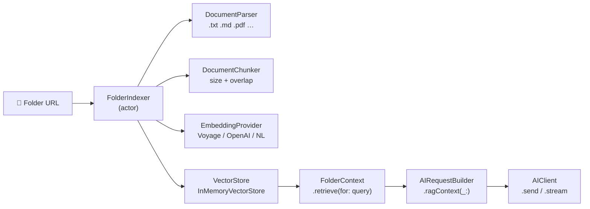

# Roadmap

This document tracks planned milestones toward the **1.0.0 MVP** release.
Each version is a git tag consumable via Swift Package Manager.

---

## 0.1.0 — Initial Demo ✅ (current)

Foundation and Claude provider. Public API is considered stable enough for
early adopters; minor breaking changes may still occur before 1.0.0.

- [x] `AIProviderKit` core — protocols, models, builders, registries, `AIClient`
- [x] `ClaudeProvider` — Anthropic Messages API (text, vision, tools, streaming)
- [x] Automatic tool-execution loop in `AIClient.send(_:)`
- [x] SSE streaming via `AsyncThrowingStream`
- [x] Recipes (`{{placeholder}}` prompt templates)
- [x] Skills (tool bundle + recipe + post-processing)
- [x] Thread-safe actor-based registries (tools, skills, recipes)
- [x] `AILogger` + `AILogStore` structured logging
- [x] `AIProviderKitUI` — SwiftUI `AILogView`
- [x] Predefined tools — `LocationTool`, `CalendarTool`, `RemindersTool`
- [x] Unit tests — 194 tests, fully mocked (no API key required)
- [x] Integration tests — `swift package integration-tests` against real Claude API
- [x] Swift 6 — full `Sendable` compliance, `StrictConcurrency`, `ExistentialAny`

---

## 0.2.0 — OpenAI Provider

- [ ] `OpenAIProvider` — Chat Completions API (text, vision, tools, streaming)
- [ ] `AIModel` constants — `gpt-4o`, `gpt-4o-mini`, `o1`, `o3-mini`
- [ ] Map OpenAI function-calling to `ContentBlock.toolUse` / `toolResult`
- [ ] Unit tests — `MockHTTPClient` pattern mirroring `ClaudeProviderTests`
- [ ] Integration tests — `swift package integration-tests` extended for OpenAI

---

## 0.3.0 — Apple Foundation Models Provider

- [ ] `FoundationModelProvider` — on-device inference via `FoundationModels` framework (iOS 26+ / macOS 26+)
- [ ] Platform guard — graceful capability check at runtime
- [ ] Streaming via `AsyncThrowingStream` wrapping the on-device stream
- [ ] Tool use mapping to Foundation Models function-calling API
- [ ] Unit + integration tests (simulator + device)

---

## Persistence Design (0.4 – 0.6)

The persistence layer is **fully modular and swappable**. A single
`SupportedConversationStore` enum selects and configures the backend at
`AIClient` initialisation time — swapping storage is a one-line change
with no other code modifications required.

```swift
// Ephemeral in-memory (default, zero dependencies)
let client = AIClient(provider: claude, store: .ephemeralMemory)

// File system (cross-platform, no extra frameworks)
let client = AIClient(provider: claude, store: .fileSystem(directory: .applicationSupport))

// Database — SwiftData (querying, migrations, multi-process)
let client = AIClient(provider: claude, store: .database(configuration: ModelConfiguration("Conversations")))
```

Each case resolves internally to a concrete type conforming to
`ConversationStore`. Callers never reference those types directly — only
the enum case and the shared protocol surface are public API.

---

## 0.4.0 — Persistence: Core Protocol & In-Memory

Establishes the persistence contract and a zero-dependency default backend.
All higher-level `AIClient` APIs are introduced here; later versions add
new `ConversationStoreBackend` cases without changing any call sites.

- [ ] `ConversationStore` protocol — provider-agnostic async CRUD for conversations and turns
- [ ] `SupportedConversationStore` enum — `.ephemeralMemory` / `.fileSystem` / `.database` cases
- [ ] `Conversation` / `ConversationTurn` models — `Codable`, `Identifiable`, timestamped
- [ ] `EphemeralMemoryConversationStore` — backing type for `.ephemeralMemory`, zero dependencies
- [ ] `AIClient` init — `store: SupportedConversationStore = .ephemeralMemory` parameter
- [ ] `AIClient` integration — `send(conversationId:message:model:)` overload that auto-loads and auto-saves turns
- [ ] Conversation management API — list, load, delete, archive
- [ ] Token-budget trimming strategy — prune oldest turns when context limit is approached
- [ ] Unit tests — full coverage using `.ephemeralMemory`

---

## 0.5.0 — Persistence: File System Backend

Maximum compatibility — works on every Apple platform and Linux without
any additional frameworks. Ships as `AIProviderKitPersistenceFS`; importing
it unlocks the `.fileSystem` case on `ConversationStoreBackend`.

- [ ] `FileSystemConversationStore` — backing type for `.fileSystem(directory:)` case
- [ ] Atomic writes — write to temp file, rename on success, no partial-write corruption
- [ ] Async I/O — file operations offloaded off the calling actor, never blocking
- [ ] Conversation index file — fast list / search without loading all turn payloads
- [ ] Import / export — portable conversation JSON bundles
- [ ] Unit tests — `tmp`-directory fixtures, cross-platform
- [ ] Integration tests — round-trip verify against real Claude responses

---

## 0.6.0 — Persistence: Database Backend

SwiftData-backed store for apps that need querying, indexing, or
multi-process access. Ships as `AIProviderKitPersistenceDB`; importing it
unlocks the `.swiftData` case on `ConversationStoreBackend`.

- [ ] `SwiftDataConversationStore` — backing type for `.database(configuration:)` case (iOS 17+ / macOS 14+)
- [ ] Schema migrations — versioned `ModelContainer` configuration
- [ ] Predicate-based search — query conversations by date, provider, model, or metadata
- [ ] `AIProviderKitUI` — conversation history list view backed by `@Query`
- [ ] Unit tests — in-memory `ModelContainer` for test isolation
- [ ] Migration utilities — import `FileSystemConversationStore` data into SwiftData

---

## 0.7.0 — Retrieval-Augmented Generation (RAG)

Provider-agnostic RAG helper layer. Ships as `AIProviderKitRAG` — an optional library product with no mandatory external dependencies.

- Full design: [`Documentation/Issues/rag-folder-context.md`](Issues/rag-folder-context.md)
- Provider feasibility analysis: [`Documentation/Investigations/RAG-Providers.md`](Investigations/RAG-Providers.md)

### Pipeline overview



### Core protocols & types

- [ ] `EmbeddingProvider` protocol — `embed(_ texts: [String]) async throws -> [[Float]]`
- [ ] `DocumentParser` protocol — `parse(url: URL) async throws -> [String]`
- [ ] `DocumentChunker` — configurable `chunkSize` + `overlap`; `ChunkSource` for citations
- [ ] `DocumentChunk` / `ChunkSource` — `Sendable`, `Identifiable`
- [ ] `VectorStore` protocol — `add`, `search`, `remove(fileURL:)`, `removeAll`
- [ ] `ScoredChunk` — chunk + cosine similarity score
- [ ] `RAGContext` — carries `[ScoredChunk]` ready for injection
- [ ] `IndexingState` — `.idle` / `.indexing(progress: Double)` / `.ready`

### Embedding providers

- [ ] `VoyageEmbeddingProvider` — Voyage AI REST API (recommended for Claude stack, requires separate API key)
- [ ] `OpenAIEmbeddingProvider` — OpenAI `/v1/embeddings` (`text-embedding-3-large` / `text-embedding-3-small`)
- [ ] `NLEmbeddingProvider` — on-device via `NaturalLanguage.NLEmbedding` (Foundation Models stack, no API key)

### Document parsers

- [ ] `TextDocumentParser` — `.txt` `.md` `.markdown` `.swift` `.json` `.yaml` `.xml`
- [ ] `PDFDocumentParser` — PDFKit, one section per page; `#if canImport(PDFKit)` guard

### Storage

- [ ] `InMemoryVectorStore` — actor; cosine nearest-neighbour via `vDSP` / pure-Swift fallback

### Indexing & retrieval

- [ ] `FolderIndexer` actor — concurrent file processing (max 8 tasks), batch embedding (×32), mtime-based incremental re-index
- [ ] `FolderContext` actor — high-level API wrapping `FolderIndexer`; token-budget auto-trim via `tokenBudgetFraction`

### Injection

- [ ] `contextWindowSize: Int` on `AIProvider` (default `200_000`) — lets the RAG layer auto-size chunk injection
- [ ] `AIRequestBuilder.ragContext(_:)` — injects `<context>[1]…[N]</context>` block as `.text` `ContentBlock` items

### OpenAI managed path (optional)

- [ ] `Tool.fileSearch(vectorStoreIds:)` — maps to OpenAI Responses API `file_search` tool; bypasses client-side pipeline

### Package

- [ ] `Package.swift` — add `AIProviderKitRAG` library product and target

### Testing

- [ ] Unit tests — in-memory store, mock embedding provider, chunk injection verification, budget trimming, incremental re-index
- [ ] Integration tests — round-trip RAG query against real Claude and OpenAI APIs (requires `ANTHROPIC_API_KEY` + `VOYAGE_API_KEY`)

---

## 1.0.0 — MVP

All of 0.2–0.7, plus:

- [ ] Stable public API guarantee (SemVer from this point forward)
- [ ] Comprehensive DocC documentation for all public symbols
- [ ] Token-counting helpers per provider
- [ ] Full test coverage report ≥ 85 %
- [ ] Example app (SwiftUI) demonstrating all three providers + persistence + RAG

---

## Beyond 1.0.0 (ideas, not committed)

- Anthropic extended thinking / reasoning steps
- OpenAI Assistants API (thread + file management) — being deprecated mid-2026 in favour of Responses API
- Prompt caching support (Anthropic / OpenAI)
- Webhook / push notification integration for long-running requests
- Android / Linux support (swift-foundation)
- SQLite vector store backend (`sqlite-vec`) for `AIProviderKitRAG`
